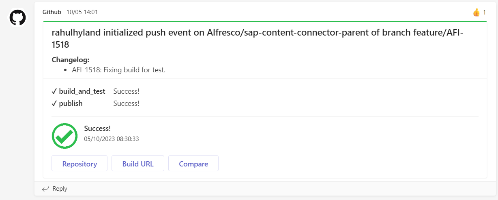
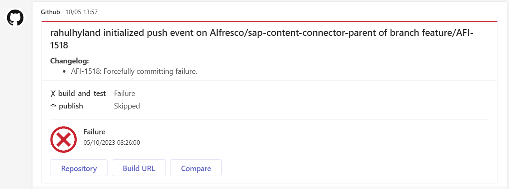

# alfresco-build-tools

[](https://github.com/pre-commit/pre-commit)
[](https://www.codacy.com/gh/Alfresco/alfresco-build-tools/dashboard?utm_source=github.com&amp;utm_medium=referral&amp;utm_content=Alfresco/alfresco-build-tools&amp;utm_campaign=Badge_Grade)

| Build     | Status                                                                                                                                                                      |
|-----------|-----------------------------------------------------------------------------------------------------------------------------------------------------------------------------|
| GitHub    | [](https://github.com/Alfresco/alfresco-build-tools/actions/workflows/test.yml) |

This repository contains shared/reusable CI configurations for GitHub Actions to serve the repositories of the Alfresco org but virtually usable by everyone.

For security-related topics of GitHub Actions, see the [Security section](security.md).

Here follows the list of GitHub Actions topics available in the current document:

- [alfresco-build-tools](#alfresco-build-tools)
  - [GitHub Actions](#github-actions)
    - [Java setup](#java-setup)
      - [Setup JDK](#setup-jdk)
      - [Setup Maven Credentials](#setup-maven-credentials)
      - [Setup Maven Build Options](#setup-maven-build-options)
  - [GitHub Actions provided by community](#github-actions-provided-by-community)
    - [Auto cancel builds](#auto-cancel-builds)
    - [Docker build and push](#docker-build-and-push)
    - [Docker login](#docker-login)
    - [pmd](#pmd)
    - [Retry failing step](#retry-failing-step)
    - [SSH debug](#ssh-debug)
    - [Triggering a workflow in another repository](#triggering-a-workflow-in-another-repository)
  - [GitHub Actions provided by us](#github-actions-provided-by-us)
    - [automate-dependabot](#automate-dependabot)
    - [automate-propagation](#automate-propagation)
    - [configure-git-author](#configure-git-author)
    - [docker-build-image](#docker-build-image)
    - [docker-dump-containers-logs](#docker-dump-containers-logs)
    - [docker-scan-image-dirs](#docker-scan-image-dirs)
    - [env-load-from-yaml](#env-load-from-yaml)
    - [free-hosted-runner-disk-space](#free-hosted-runner-disk-space)
    - [get-branch-name](#get-branch-name)
    - [get-build-info](#get-build-info)
    - [git-check-existing-tag](#git-check-existing-tag)
    - [get-commit-message](#get-commit-message)
    - [git-commit-changes](#git-commit-changes)
    - [git-latest-tag](#git-latest-tag)
    - [helm-build-chart](#helm-build-chart)
    - [helm-integration-tests](#helm-integration-tests)
    - [helm-package-chart](#helm-package-chart)
    - [helm-parse-next-release](#helm-parse-next-release)
    - [helm-publish-chart](#helm-publish-chart)
    - [helm-release-and-publish](#helm-release-and-publish)
    - [helm-template-yamllint](#helm-template-yamllint)
    - [helm-plugin](#helm-plugin)
    - [helm-update-chart-version](#helm-update-chart-version)
    - [jx-updatebot-pr](#jx-updatebot-pr)
    - [kubectl-keep-nslogs](#kubectl-keep-nslogs)
    - [load-release-descriptor](#load-release-descriptor)
    - [maven-build-and-tag](#maven-build-and-tag)
      - [Preview option for maven-build-and-tag](#preview-option-for-maven-build-and-tag)
    - [maven-deploy-file](#maven-deploy-file)
    - [maven-release](#maven-release)
    - [maven-update-pom-version](#maven-update-pom-version)
    - [nexus-create-staging](#nexus-create-staging)
    - [nexus-close-staging](#nexus-close-staging)
    - [nexus-release-staging](#nexus-release-staging)
    - [pre-commit](#pre-commit)
    - [pre-commit-default](#pre-commit-default)
    - [process-coverage-report](#process-coverage-report)
    - [pipenv](#pipenv)
    - [rancher](#rancher)
    - [reportportal-prepare](#reportportal-prepare)
    - [reportportal-summarize](#reportportal-summarize)
    - [send-slack-notification-slow-job](#send-slack-notification-slow-job)
    - [send-slack-notification](#send-slack-notification)
    - [send-teams-notification](#send-teams-notification)
    - [setup-github-release-binary](#setup-github-release-binary)
    - [setup-java-build](#setup-java-build)
    - [setup-kind](#setup-kind)
    - [update-project-base-tag](#update-project-base-tag)
    - [validate-maven-versions](#validate-maven-versions)
    - [veracode](#veracode)
  - [Reusable workflows provided by us](#reusable-workflows-provided-by-us)
    - [helm-publish-new-package-version.yml](#helm-publish-new-package-versionyml)
  - [Cookbook](#cookbook)
    - [Conditional job/step depending on PR labels](#conditional-jobstep-depending-on-pr-labels)
    - [Serialize pull request builds](#serialize-pull-request-builds)
  - [Known issues](#known-issues)
    - [realpath not available under macosx](#realpath-not-available-under-macosx)
  - [Release](#release)

## GitHub Actions

### Java setup

#### Setup JDK

[actions/setup-java](https://github.com/actions/setup-java) should be used, here is a sample usage:

```yml
      - name: Set up JDK 11
        uses: actions/setup-java@v3
        with:
          java-version: '11'
          distribution: 'temurin'
          cache: 'maven'
```

#### Setup Maven Credentials

Credentials should be already available via organization secrets, otherwise they would need to be
provided as repository secrets.

Since repositories hold a `settings.xml` file at the root with environment variables `MAVEN_USERNAME` and
`MAVEN_USERNAME` filled for the username and password, only a mapping of variables is needed:

```yml
      - name: Build with Maven
        run: mvn --settings settings.xml [...]
        env:
          MAVEN_USERNAME: ${{ secrets.NEXUS_USERNAME }}
          MAVEN_USERNAME: ${{ secrets.NEXUS_PASSWORD }}
```

Alternatively, the [s4u/maven-settings-action](https://github.com/s4u/maven-settings-action) could be used.

#### Setup Maven Build Options

Maven build options can be shared for a given step on the mvn command line, or extracted as environment variables.

Sample usage:

```yml
      - name: Test with Maven
        run: mvn verify ${{ env.MAVEN_CLI_OPTS }}
        env:
          MAVEN_CLI_OPTS: --show-version -Ddocker.skip -Dlogging.root.level=off -Dspring.main.banner-mode=off
```

When deploying in a second step, these variables can be shared:

```yml
env:
  MAVEN_CLI_OPTS: --show-version -Dlogging.root.level=off -Dspring.main.banner-mode=off

[...]

      - name: Test with Maven
        run: mvn verify ${{ env.MAVEN_CLI_OPTS }}
      - name: Deploy with Maven
        run: mvn deploy ${{ env.MAVEN_CLI_OPTS }} -DskipTests
```

When migrating from Travis, depending on the previous configuration, docker.skip and docker.tag properties might need
to be setup on the command line.

Here is a sample way to extract a branch name that would be used for docker images built with the `build-and-push-docker-images.sh` script, although using the [dedicated action](#docker-build-and-push) can also be
useful.

```yml
      - name: Set stripped branch name as tag
        run: echo "STRIPPED_TAG=$(echo ${{ github.ref_name }} | sed -e 's/[^-_.[:alnum:]]/_/g')" >> $GITHUB_ENV
      - name: Docker Build and Push
        run: sh ./build-and-push-docker-images.sh
        env:
          TAG: ${{ env.STRIPPED_TAG }}
```

## GitHub Actions provided by community

### Auto cancel builds

[This action](https://github.com/styfle/cancel-workflow-action) is a replacement for the Travis settings **Auto cancel branch builds** and **Auto cancel pull request builds**.

### Docker build and push

Consider using this official [Docker action](https://github.com/marketplace/actions/build-and-push-docker-images) for building and pushing containers instead of doing it by hand, for buildx support, caching and more.

### Docker login

Credentials should be already available via organization secrets, otherwise they would need to be
provided as repository secrets.

```yml
      - name: Login to Docker Hub
        uses: docker/login-action@v2
        with:
          username: ${{ secrets.DOCKER_USERNAME }}
          password: ${{ secrets.DOCKER_PASSWORD }}

      - name: Login to Quay.io
        uses: docker/login-action@v2
        with:
          registry: quay.io
          username: ${{ secrets.QUAY_USERNAME }}
          password: ${{ secrets.QUAY_PASSWORD }}
```

### pmd

[Yet Another PMD Scan](https://github.com/Alfresco/ya-pmd-scan) is a GitHub Action primarily for Alfresco repositories. It is a bit more involved than most of the actions in this repository and so has been split out into a repository of its own.

The action runs the [PMD](https://pmd.github.io/) static analysis tool to look for common programming flaws in files modified by PRs.

### Retry failing step

[This action](https://github.com/nick-fields/retry) retries an Action step on failure or timeout. Useful for unstable commands or that relies on remote resources that can be flaky sometimes.

### SSH debug

GitHub doesn't provide any native support for SSH debug access to builds.

To debug a build is necessary to add when needed a step like the following in
the workflow:

```yml
    - name: Setup tmate session
      uses: mxschmitt/action-tmate@v3
      with:
        # provide access to SSH user that triggered the build
        limit-access-to-actor: true
```

You can also run the step on-demand with a manually triggered build by adding
the `workflow_dispatch` event together with a boolean input:

```yaml
on:
  workflow_dispatch:
    inputs:
      debug_enabled:
        description: Enable SSH debug
        type: boolean
        required: false
        default: false
```

and then invoke the action step conditionally based on this event and input
value:

```yaml
    steps:
    - uses: actions/checkout@v3
    - name: Setup tmate session
      # run only when explicitly requested
      if: ${{ github.event_name == 'workflow_dispatch' && inputs.debug_enabled }}
      uses: mxschmitt/action-tmate@v3
      with:
        # provide access to SSH user that triggered the build
        limit-access-to-actor: true
      # automatically terminate after a given timeout
      timeout-minutes: 30
```

When executing that step, the job will block. If you want to continue with the
following steps, just create a file named `continue` in the current workspace
folder:

```sh
touch continue
```

Please be aware that when the last command of the job finish, also the tmate
session will be terminated automatically, so you may want to add at the end of
the workflow a step like:

```yaml
    # wait for 5 minutes before exiting
    - run: sleep 300
```

### Triggering a workflow in another repository

[actions/github-script](https://github.com/actions/github-script) can be used, here is a sample:

```yml
      - name: Trigger Downstream Builds
        if: steps.is_default_branch.outputs.result == 'true'
        uses: actions/github-script@v5
        with:
          github-token: ${{ secrets.BOT_GITHUB_TOKEN }}
          script: |
            await github.rest.actions.createWorkflowDispatch({
              owner: 'Alfresco',
              repo: 'alfresco-process-connector-services',
              workflow_id: 'build.yml',
              ref: 'develop'
            });
```

Note that this requires using a dedicated token.

Also, the triggered workflow should allow workflow dispatch in its definition (and this configuration should be setup
on the default branch):

```yml
on:
  # allows triggering workflow manually or from other jobs
  workflow_dispatch:
```

## GitHub Actions provided by us

### automate-dependabot

Handles automated approval and merge of dependabot PRs, for minor and patch version updates only:

- automated approval on minor and patch versions
- automated merge on patch versions

This action requires a dedicated secret (named `DEPENDABOT_GITHUB_TOKEN` in the sample) to setup the "auto-merge" behavior: the default `GITHUB_TOKEN` is not used in this case, otherwise a build would not be triggered when the PR is merged, [see reference solution](https://david.gardiner.net.au/2021/07/github-actions-not-running.html).

This secret should be a [dependabot secret](https://docs.github.com/en/code-security/dependabot/working-with-dependabot/managing-encrypted-secrets-for-dependabot), and the token should hold the `repo > repo:status` and `repo > public_repo` scopes for public repositories.
The whole list of "repo" scopes might be needed for the workflow to run ok on private repositories.

```yaml
    - uses: Alfresco/alfresco-build-tools/.github/actions/automate-dependabot@ref
      with:
        token: ${{ secrets.DEPENDABOT_GITHUB_TOKEN }}
```

### automate-propagation

Handles automated approval and merge of propagation PRs used to handle alpha releases on builds.

This action requires a dedicated secret (named `BOT_GITHUB_TOKEN` in the sample) to setup the "auto-merge" behavior: the default `GITHUB_TOKEN` is not used in this case, otherwise a build would not be triggered when the PR is merged, [see reference solution](https://david.gardiner.net.au/2021/07/github-actions-not-running.html).

Another token is also needed to handled approval. It can be the default `GITHUB_TOKEN`, but it cannot be the same one that is used for auto-merge behavior as the user might match the creator of the PR (and auto-approval of a PR is not allowed).

```yaml
    - uses: Alfresco/alfresco-build-tools/.github/actions/automate-propagation@ref
      with:
        auto-merge-token: ${{ secrets.BOT_GITHUB_TOKEN }}
        approval-token: ${{ secrets.GITHUB_TOKEN }}
```

### configure-git-author

Configures the git username and email to associate commits with the provided identity

```yaml
      - uses: Alfresco/alfresco-build-tools/.github/actions/configure-git-author@ref
        with:
          username: ${{ vars.BOT_GITHUB_USERNAME }}
          email: ${{ vars.BOT_GITHUB_EMAIL }}
          global: true
```

The two vars in the previous snippet are [workflow configuration variables](https://github.blog/changelog/2023-01-10-github-actions-support-for-configuration-variables-in-workflows/) that can be created at organization level and shared across different repositories.

### docker-build-image

Build docker image based on supplied jar files. It replaces `image-dir` and `image-tag` in the
docker file and builds it.

After the build, if `grype-scan-enabled` is `true`, it scans the image using grype and uploads the result in GitHub security.

Finally, it pushes the created image into:

- RedHat quay.io
- GitHub ghcr
- AWS ECR

When using OIDC on AWS, inputs `aws-access-key-id` and `aws-secret-access-key` can be omitted: the `aws-role-name` input should be used instead.

```yaml
      - uses: Alfresco/alfresco-build-tools/.github/actions/docker-build-image@ref
        with:
          image-tag: ${{ needs.build.outputs.version }}
          image-dir: ${{ matrix.image-dir }}
          docker-username: ${{ secrets.DOCKER_USERNAME }}
          docker-password: ${{ secrets.DOCKER_PASSWORD }}
          quay-username: ${{ secrets.QUAY_USERNAME }}
          quay-password: ${{ secrets.QUAY_PASSWORD }}
          ghcr-token: ${{ secrets.GITHUB_TOKEN }}
          aws-access-key-id: ${{ secrets.HXPS_DEV_SVC_ECR_WRITE_AWS_ACCESS_KEY_ID }}
          aws-secret-access-key: ${{ secrets.HXPS_DEV_SVC_ECR_WRITE_AWS_SECRET_ACCESS_KEY }}
          aws-account-id: ${{ vars.ACCOUNT_ID }}
          # aws-region: ${{ vars.AWS_REGION }} # optional
          # aws-role-name: ${{ vars.AWS_ROLE_NAME }} # optional
          # grype-scan-enabled: true # optional
          # grype-fail-build: true # optional
          # preview-label: ${{ vars.PREVIEW_LABEL }} # optional
```

### docker-dump-containers-logs

Dumps Docker containers logs. Each container's log will be stored in a separate `<container_name>.log` file. All files will be archived by default under `containers-logs-<job_id>-<job_retry_number>-<timestamp>.tar.gz` and will be available to download via the workflow's summary page.
It is also possible to specify the output archive name when providing the `output-archive-name` parameter.

```yaml
      - uses: Alfresco/alfresco-build-tools/.github/actions/docker-dump-containers-logs@ref
```

### docker-scan-image-dirs

Scan the directories were the Dockerfiles are to feed the scanner.

```yaml
      - uses: Alfresco/alfresco-build-tools/.github/actions/docker-scan-image-dirs@ref
```

### env-load-from-yaml

To ease the migration to GitHub Actions of repositories that contains one or
more yaml files containing an `env.global` section of Travis CI. It supports env vars
referencing as value env vars defined early in the file (like Travis does).

```yaml
      - uses: Alfresco/alfresco-build-tools/.github/actions/env-load-from-yaml@ref
        with:
          ignore_regex: ^BRANCH_NAME=.*
          yml_path: .travis/env.yml
```

### free-hosted-runner-disk-space

Removes unnecessary folders and files from a GHA [hosted runner](https://docs.github.com/en/actions/using-github-hosted-runners/about-github-hosted-runners). This action might be useful when we run jobs which require a lot of disk space.

```yaml
      - uses: Alfresco/alfresco-build-tools/.github/actions/free-hosted-runner-disk-space@ref
```

By default it removes following directories:

- `/usr/share/dotnet`
- `/opt/ghc`
- `/usr/local/share/boost`
- `$AGENT_TOOLSDIRECTORY`

You can override the default behavior by specifying your own collection of files and directories using `to-remove` input parameter.

### get-branch-name

Loads the name of the branch on which the action was called into `BRANCH_NAME` environment variable

```yaml
      - uses: Alfresco/alfresco-build-tools/.github/actions/get-branch-name@ref
```

### get-build-info

[get-build-info](../.github/actions/get-build-info/action.yml) loads build-related info into the runner env, in the form of generically named variables that are not necessarily specific to GitHub.

```yaml
      - uses: Alfresco/alfresco-build-tools/.github/actions/get-build-info@ref
```

### git-check-existing-tag

Checks if a tag with the given name already exists for this remote repository. Returns the output named `exists` with value `'true'` or `'false'`.

```yaml
    - uses: Alfresco/alfresco-build-tools/.github/actions/git-check-existing-tag@ref
      with:
        tag: 1.0.0
```

### get-commit-message

Loads the content of the last commit message that triggered the action into `COMMIT_MESSAGE` environment variable
This action requires a checkout with fetch-depth option as follow:

```yaml

      - uses: actions/checkout@v3
        with:
          fetch-depth: 0
      - uses: Alfresco/alfresco-build-tools/.github/actions/get-commit-message@ref
```

### git-commit-changes

Commits local changes after configuring git user and showing the status of what is going be committed.
If `skip-if-no-changes` input is set to `true` then an empty commit will not be committed at all.

```yaml
    - uses: Alfresco/alfresco-build-tools/.github/actions/git-commit-changes@ref
      with:
        username: ${{ secrets.BOT_GITHUB_USERNAME }}
        add-options: -u
        commit-message: "My commit message"
```

### git-latest-tag

Gets the latest tag and commit sha for the given pattern. The result is returned in the output named `tag` and `tag_long_sha`.

```yaml
      - uses: Alfresco/alfresco-build-tools/.github/actions/git-latest-tag@ref
        with:
          pattern: 1.0.0-alpha*
```

### helm-build-chart

Run `helm dep up` and `helm lint` on the specified chart

```yaml
      - uses: Alfresco/alfresco-build-tools/.github/actions/helm-build-chart@ref
        with:
          chart-dir: charts/common
```

### helm-integration-tests

Run `helm upgrade --dryn-run` on the specified chart

```yaml
      - name: Execute dry run
        uses: Alfresco/alfresco-build-tools/.github/actions/helm-integration-tests@ref
        with:
          chart-dir: ${{ env.CHART_DIR }}
          test-rancher-url: ${{ secrets.RANCHER2_URL }}
          test-rancher-access-key: ${{ secrets.RANCHER2_ACCESS_KEY }}
          test-rancher-secret-key: ${{ secrets.RANCHER2_SECRET_KEY }}
          test-cluster-name: ${{ env.TEST_CLUSTER_NAME }}
          test-namespace: ${{ env.TEST_NAMESPACE }}
```

### helm-package-chart

Packages a helm chart into a `.tgz` file and provides the name of the file produced in the output named `package-file`, and its path in the output named `package-file-path`.
The packaged file is also uploaded as an artifact and can be downloaded using `actions/download-artifact`.

```yaml
    - uses: Alfresco/alfresco-build-tools/.github/actions/helm-package-chart@ref
      id: package-helm-chart
      with:
        chart-dir: charts/common
```

### helm-parse-next-release

Parses the next main release version based on the content of Chart.yaml file. The result will be returned using the output named `next-release`.
The suffix `-SNAPSHOT` is removed. For instance, if the version attribute in the Chart.yaml file is `1.0.0-SNAPSHOT`, the result will be `1.0.0`

```yaml
      - uses: Alfresco/alfresco-build-tools/.github/actions/helm-parse-next-release@ref
        id: parse-next-release
        with:
          chart-dir: charts/common
```

### helm-publish-chart

Publishes a new helm chart package (`.tgz`) to a helm chart repository

```yaml
      - uses: Alfresco/alfresco-build-tools/.github/actions/helm-publish-chart@ref
        with:
          helm-charts-repo: Activiti/activiti-cloud-helm-charts
          helm-charts-repo-branch: gh-pages
          chart-package: ${{ steps.package-helm-chart.outputs.package-file-path }}
          token: ${{ secrets.BOT_GITHUB_TOKEN}}
```

### helm-release-and-publish

Releases a new version of a helm chart and publishes it to a helm repository

```yaml
      - uses: Alfresco/alfresco-build-tools/.github/actions/helm-release-and-publish@ref
        with:
          version: 1.0.0
          chart-dir: charts/common
          chart-repository-dir: ${{ env.COMMON_CHART_DIR }}
          helm-repository: Activiti/activiti-cloud-helm-charts
          helm-repository-branch: gh-pages
          helm-repository-token: ${{ secrets.GITHUB_TOKEN }}
          git-username:  ${{ secrets.GITHUB_USERNAME }}
```

### helm-template-yamllint

Render Helm chart templates and pipe into yamllint, that can check for
duplicated keys and other inconsistencies that helm itself doesn't care of. The
action embed a
[yamllint](.github/actions/../../../.github/actions/helm-template-yamllint/.yamllint.yml)
configuration files that should be suitable for most use cases.

```yaml
      - uses: Alfresco/alfresco-build-tools/.github/actions/helm-template-yamllint@ref
        with:
          chart-dir: helm/my-chart # defaults to current working directory
          helm-options: --values tests/values/test_values.yaml --set persistence.enabled=false # to handle mandatory values or test different rendering
          yamllint-config-path: ./.yamllint.yaml # alternative path to yamllint config to override the default one
```

### helm-plugin

Install requested Helm plugin

```yaml
     - uses: >-
         Alfresco/alfresco-build-tools/.github/actions/helm-plugin@ref
       with:
         plugin_url: https://domain/path/to/
         plugin_version: v1.0.0
```

`plugin_version` can be skipped so the latest release of the plugin will be installed

### helm-update-chart-version

Updates `version` attribute inside `Chart.yaml` file:

```yaml
      - uses: Alfresco/alfresco-build-tools/.github/actions/helm-update-chart-version@ref
        with:
          new-version: 1.0.0
```

### jx-updatebot-pr

Create a Pull Request on each downstream repository using [jx-updatebot](https://github.com/jenkins-x-plugins/jx-updatebot).

Given `.jx/updatebot.yaml` spec in the `alfresco-modeling-service` project:

```yaml
apiVersion: updatebot.jenkins-x.io/v1alpha1
kind: UpdateConfig
spec:
  rules:
    - urls:
        - https://github.com/alfresco/alfresco-process-releases
      reusePullRequest: true
      changes:
        - regex:
            pattern: "version: (.*)"
            files:
              - "docker/quay.io/alfresco/alfresco-modeling-service.yml"
        - regex:
            pattern: "<alfresco-modeling-service.version>(.*)</alfresco-modeling-service.version>"
            files:
              - pom.xml
```

This action will promote alpha version to `alfresco-process-releases` repository via pull request. It will add new commit if there is an existing PR with matching `develop` label.

```yaml
      - name: Promote version
        uses: Alfresco/alfresco-build-tools/.github/actions/jx-updatebot-pr@ref
        with:
          version: ${{ steps.tag.outputs.version }}
          labels: develop
          pull-request-title: "promote(dep): update versions into ${{ github.ref_name }}"
          commit-title: "chore(dep): update ${{ github.repository }} version to ${{ steps.tag.outputs.version }}"
          base-branch-name: ${{ github.ref_name }}
          git-username: ${{ secrets.GIT_USERNAME }}
          git-token: ${{ secrets.GIT_TOKEN }}
          git-author-name: ${{ secrets.GIT_AUTHOR_NAME }}
          git-author-email: ${{ secrets.GIT_AUTHOR_EMAIL }}
```

### kubectl-keep-nslogs

This action allow to collect logs from pods if they are referenced in a deployment, a statefulset or a job.

```yaml
    - name: Upload pods logs
      if: always()
      uses: >-
        Alfresco/alfresco-build-tools/.github/actions/kubectl-keep-nslogs@ref
      with:
        namespace: mynsapp
        log_retention: 7
```

### load-release-descriptor

Used to release Activiti Projects. Load release information from release.yaml file.

```yaml
      - uses: Alfresco/alfresco-build-tools/.github/actions/load-release-descriptor@ref
        id: load-descriptor
        with:
          release-descriptor: release.yaml
```

### maven-build-and-tag

Check out, builds a maven project and docker images, generating a new alpha version for it on push events:

- publish maven artifacts to Nexus
- push docker images to quay.io
- create GitHub tag for the new alpha release

```yaml
    outputs:
      version: ${{ steps.build-and-tag.outputs.version }}
    steps:
      - uses: Alfresco/alfresco-build-tools/.github/actions/maven-build-and-tag@ref
        id: build-and-tag
        with:
          maven-username: ${{ secrets.NEXUS_USERNAME }}
          maven-password: ${{ secrets.NEXUS_PASSWORD }}
          quay-username: ${{ secrets.QUAY_USERNAME }}
          quay-password: ${{ secrets.QUAY_PASSWORD }}
          docker-username: ${{ secrets.DOCKER_USERNAME }}
          docker-password: ${{ secrets.DOCKER_PASSWORD }}
          git-username: ${{ secrets.BOT_GITHUB_USERNAME }}
```

#### Preview option for maven-build-and-tag

There is a possibility to publish snapshot maven artifacts and docker images from an open PR.
In order to use it specify `preview-label` input (or use default `preview`). Create a PR with the `preview-label` label.
The created maven artifacts and docker images will be tagged as `0.0.1-$GITHUB_PR_NUMBER-SNAPSHOT`.

### maven-deploy-file

Upload one or more files to a maven server, without requiring the presence of a
pom.xml. It provides a settings.xml when can find one already configured. When
using a custom settings.xml, you probably want to provide also
`repository-id` that match the credentials id to be used for deploying.

```yaml
      - name: Deploy to Nexus
        uses: Alfresco/alfresco-build-tools/.github/actions/maven-deploy-file@ref
        with:
          group-id: org.alfresco
          artifact-id: custom-alfresco-distribution
          repository-url: https://nexus.alfresco.com/nexus/content/repositories/a-valid-repo/
          version: "1.2.3"
          file: output/build.jar
          classifier: binary
          files: output/build-alt.jar,output/build-alt2.jar
          classifiers: alt,alt2
          types: jar,jar
          maven-username: ${{ secrets.NEXUS_USERNAME }}
          maven-password: ${{ secrets.NEXUS_PASSWORD }}
```

### maven-release

Used to release Activiti projects. Update versions in POM files, create git tags and publish Maven artifacts to staging repository.

```yaml
      - uses: Alfresco/alfresco-build-tools/.github/actions/maven-release@ref
        with:
          repo: Activiti/Activiti
          base-ref: ${{  needs.load-release-info.outputs.activiti-tag }}
          release-version: ${{ needs.load-release-info.outputs.version }}
          staging-repository: ${{ needs.load-release-info.outputs.staging-repository }}
          git-username: ${{ secrets.GITHUB_USERNAME }}
          github-token: ${{ secrets.GITHUB_TOKEN }}
          gpg-passphrase: "${{ secrets.GPG_PASSPHRASE }}"
          gpg-secret-keys: "${{ secrets.GPG_SECRET_KEYS }}"
          gpg-owner-trust: "${{ secrets.GPG_OWNERTRUST }}"
          nexus-username: "${{ secrets.NEXUS_USERNAME }}"
          nexus-password: "${{ secrets.NEXUS_PASSWORD }}"
```

### maven-update-pom-version

Updates pom files to the provided version

```yaml
    - uses: Alfresco/alfresco-build-tools/.github/actions/maven-update-pom-version@ref
      with:
        version: 1.0.0-alpha.1
```

### nexus-create-staging

Creates a new staging repository on Nexus, unless there is an existing repository with the same description.
The resulting staging repository will be available in the output named `staging-repository`.

```yaml
      - uses: Alfresco/alfresco-build-tools/.github/actions/nexus-create-staging@ref
        with:
          staging-description: Activiti staging ${{ steps.load-descriptor.outputs.version }}
          nexus-profile-id: "${{ secrets.NEXUS_ACTIVITI7_PROFILE_ID }}"
          nexus-username: "${{ secrets.NEXUS_USERNAME }}"
          nexus-password: "${{ secrets.NEXUS_PASSWORD }}"
```

### nexus-close-staging

Closes the specified staging repository on Nexus.

```yaml
      - uses: Alfresco/alfresco-build-tools/.github/actions/nexus-close-staging@ref
        with:
          version: ${{ inputs.version }}
          staging-repository: ${{ inputs.staging-repository}}
          nexus-username: ${{ secrets.NEXUS_USERNAME }}
          nexus-password: ${{ secrets.NEXUS_PASSWORD }}
```

### nexus-release-staging

Releases the specified staging repository on Nexus. The repository should be in the closed status before.

```yaml
      - uses: Alfresco/alfresco-build-tools/.github/actions/nexus-release-staging@ref
        with:
          version: ${{ inputs.version }}
          staging-repository: ${{ inputs.staging-repository}}
          nexus-username: ${{ secrets.NEXUS_USERNAME }}
          nexus-password: ${{ secrets.NEXUS_PASSWORD }}
```

### pre-commit

Executes a [pre-commit](https://pre-commit.com/) step.

This action is usually added in a dedicated workflow:

```yml
name: pre-commit

on:
  pull_request:
    branches: [ master ]
  push:
    branches: [ master ]

jobs:
  pre-commit:
    runs-on: ubuntu-latest
    permissions:
      contents: write # required only when auto-commit is enabled
    steps:
      - uses: Alfresco/alfresco-build-tools/.github/actions/pre-commit@ref
        with:
          auto-commit: "true" # optionally commit automated fix changes back
```

This action requires a pre-existing `.pre-commit-config.yaml` file that needs to
be present into the caller repository. You can find more documentation related
to pre-commit hooks in the [dedicated section](pre-commit-hooks.md).

Note that this action includes an `actions/checkout` as a first step that
usually helps when running this step as the first step in a job and is mandatory
for the proper handling of auto-commit feature, unless you specify:

```yml
      - uses: Alfresco/alfresco-build-tools/.github/actions/pre-commit@ref
        with:
          skip_checkout: "true"
```

### pre-commit-default

Executes pre-commit checks using shared configuration.

The shared configuration is grouped inside different sets that can be disabled thanks to inputs (both are enabled by default):

- `check-format`: handles standard formatter checks, including Java files leveraging [prettier](https://prettier.io/) and [prettier Java plugin](https://github.com/jhipster/prettier-java)
- `check-github-configuration`: performs json schema checks on GH actions, workflows and dependabot configuration, leveraging [jcheck-jsonschema](https://check-jsonschema.readthedocs.io/en/latest/precommit_usage.html)

To replicate locally the same checks, the corresponding configuration files must be used:

- [format-config.yaml](../.github/actions/pre-commit-default/format-config.yaml)
- [github-config.yaml](../.github/actions/pre-commit-default/github-config.yaml)

Sample command lines:

```bash
pre-commit run -a --config /path/to/config/format-config.yaml
pre-commit run -a --config /path/to/config/github-config.yaml
```

Unlike the [pre-commit](#pre-commit) action, the `actions/checkout` action is not part of this action and should explicitly be added if not already done before in the workflow:

```yml
      - uses: actions/checkout@v3
      - uses: Alfresco/alfresco-build-tools/.github/actions/pre-commit-default@ref
```

This action can also be used in combination with the [pre-commit](#pre-commit) action, that will perform a checkout anyway. This allows combining default pre-commit checks with additional local checks configured in the local `.pre-commit-config.yaml` file that is part of the caller repository:

```yml
      - uses: Alfresco/alfresco-build-tools/.github/actions/pre-commit@ref
      - uses: Alfresco/alfresco-build-tools/.github/actions/pre-commit-default@ref
```

Sample usage of inputs:

```yml
      - uses: Alfresco/alfresco-build-tools/.github/actions/pre-commit-default@ref
        with:
          check-format: 'false'
```

Or:

```yml
      - uses: Alfresco/alfresco-build-tools/.github/actions/pre-commit-default@ref
        with:
          check-github-configuration: 'false'
```

### process-coverage-report

This workflow processes the coverage report to add the total coverage percentage as a comment on a PR

```yml
        id: process-coverage-report
        uses: Alfresco/alfresco-build-tools/.github/actions/process-coverage-report@ref
        with:
          paths: |
            ${{ github.workspace }}/**/build/reports/jacoco/prodNormalDebugCoverage/prodNormalDebugCoverage.xml,
            ${{ github.workspace }}/**/build/reports/jacoco/**/debugCoverage.xml
          token: ${{ secrets.GITHUB_TOKEN }}
          min-coverage-overall: 80
          min-coverage-changed-files: 90
```

### pipenv

This workflow sets up a Python environment using the standard setup-python action and utilizes the pipenv action to manage Python dependencies declared in the Pipfile and based on the specified Python version

```yml
      - uses: actions/checkout@v3
      - uses: actions/setup-python@v4
        id: setup-python
        with:
          python-version: "3.9"
      - uses: Alfresco/alfresco-build-tools/.github/actions/pipenv@ref
        with:
          python-version: ${{ steps.setup-python.outputs.python-version }}
```

### rancher

register or detach an EKS cluster to Rancher.
AWS credentials are required only when registering the cluster.

```yaml
      - name: Register Cluster
        uses: Alfresco/alfresco-build-tools/.github/actions/rancher@ref
        with:
          rancher-url: ${{ env.RANCHER2_URL }}
          rancher-access-key: ${{ secrets.RANCHER2_ACCESS_KEY }}
          rancher-secret-key: ${{ secrets.RANCHER2_SECRET_KEY }}
          cluster-name: ${{ env.CLUSTER_NAME }}
          action: "register"
          aws-access-key: ${{ secrets.AWS_ACCESS_KEY_ID }}
          aws-secret-key: ${{ secrets.AWS_SECRET_ACCESS_KEY }}
          aws-region: "us-east-2"
```

### reportportal-prepare

Prepares [Report Portal](https://reportportal.io/) configuration information, and makes it available in outputs to be used by other actions.

This action is usually used in combination with [reportportal-summarize](#reportportal-summarize).

In particular, this prepares maven command line options for Report Portal integration, building the endpoint, authentication, launch key, description.
Default context information is also added (launch attributes), unless the `auto-configure` input is set to `false`.

Sample options with auto-configuration:

```bash
"-Drp.launch=short-run-push-3674979523" "-Drp.uuid=***" "-Drp.endpoint=http://localhost:8080" "-Drp.project=my-project" "-Drp.description=[Run on GitHub Actions 3674979523](https://github.com/Alfresco/alfresco-build-tools/actions/runs/3674979523)" "-Drp.attributes=branch:my-branch;event:push;repository:Alfresco/alfresco-build-tools;run:short-run-push-3674979523;myattribute:my-filter"
```

Sample options without auto-configuration:

```bash
"-Drp.launch=short-run-push" "-Drp.uuid=***" "-Drp.endpoint=http://localhost:8080" "-Drp.project=my-project"
```

Sample usage:

```yaml

env:
  # the github event name and run id will be automatically added to the launch key
  RP_LAUNCH_PREFIX: my-test-run
  RP_TOKEN: ${{ secrets.RP_TOKEN }}
  # should not be a secret to be visible in summary and slack messages
  RP_URL: http://localhost:8080
  RP_PROJECT: my-project
  RP_FILTER: my-filter

[...]

    - name: Prepare Report Portal
      uses: Alfresco/alfresco-build-tools/.github/actions/reportportal-prepare@ref
      id: rp-prepare
      with:
        rp-launch-prefix: ${{ env.RP_LAUNCH_PREFIX }}
        rp-token: ${{ env.RP_TOKEN }}
        rp-url: ${{ env.RP_URL }}
        rp-project: ${{ env.RP_PROJECT }}
        rp-extra-attributes: ";myattribute:${{ env.RP_FILTER }}"

    - name: Add GitHub Step Summary
      shell: bash
      env:
        RP_ENABLED: ${{ steps.rp-prepare.outputs.enabled }}
        RP_KEY: ${{ steps.rp-prepare.outputs.key }}
        RP_URL: ${{ steps.rp-prepare.outputs.url }}
      run: |
        echo "#### ⏱ Before Tests: $(date -u +'%Y-%m-%d %H:%M:%S%:z')" >> $GITHUB_STEP_SUMMARY
        echo "#### ⚙ Configuration" >> $GITHUB_STEP_SUMMARY
        if [[ "$RP_ENABLED" == 'true' ]]; then
          echo "- [Report Portal]($RP_URL) configured with key "'`'$RP_KEY'`' >> $GITHUB_STEP_SUMMARY
        else
          echo "- Report Portal not enabled" >> $GITHUB_STEP_SUMMARY
        fi
        echo "- My filter attribute: "'`'${{ env.RP_FILTER }}'`' >> $GITHUB_STEP_SUMMARY

    - name: Run Tests (continue on error)
      id: run-tests
      shell: bash
      env:
        MAVEN_USERNAME: ${{ inputs.maven-username }}
        MAVEN_PASSWORD: ${{ inputs.maven-password }}
        RP_OPTS: ${{ steps.rp-prepare.outputs.mvn-opts }}
      run: mvn clean verify ${{ env.RP_OPTS }}
      continue-on-error: true

    - name: Update GitHub Step Summary
      shell: bash
      run: |
        echo "#### ⏱ After Tests: $(date -u +'%Y-%m-%d %H:%M:%S%:z')" >> $GITHUB_STEP_SUMMARY

    - name: Summarize Report Portal
      uses: Alfresco/alfresco-build-tools/.github/actions/reportportal-summarize@ref
      id: rp-summarize
      with:
        tests-outcome: ${{ steps.run-tests.outcome }}
        rp-launch-key: ${{ steps.rp-prepare.outputs.key }}
        rp-url: ${{ env.RP_URL }}
        rp-project: ${{ env.RP_PROJECT }}

```

This will create launches on Report Portal that looks like:


This will give the following sample output on the GH Actions run summary (when used in combination with follow-up action `reportportal-summarize` documented in the next section):


### reportportal-summarize

Used in combination with [reportportal-prepare](#reportportal-prepare).

Adds a message to the steps summary when Report Portal usage is detected.
Also builds a message to be sent to slack.
The message contains links to the workflow Report Portal launches.

Sample usage (as follow-up of above sample):

```yaml
    - name: Summarize Report Portal
      uses: Alfresco/alfresco-build-tools/.github/actions/reportportal-summarize@ref
      id: rp-summarize
      with:
        tests-outcome: ${{ steps.run-tests.outcome }}
        rp-launch-key: ${{ steps.rp-prepare.outputs.key }}
        rp-url: ${{ env.RP_URL }}
        rp-project: ${{ env.RP_PROJECT }}

    - name: Exit on failure
      if: steps.run-tests.outcome != 'success'
      shell: bash
      run: |
        echo "::error title=run-tests::Tests failed: re-throwing on error."
        exit 1

    - name: Notify Slack on failure
      if: always() && failure()
      uses: Alfresco/alfresco-build-tools/.github/actions/send-slack-notification@ref
      with:
        channel-id: "channel-id"
        token: ${{ secrets.SLACK_BOT_TOKEN }}
        message: ${{ steps.rp-summarize.outputs.slack-message }}
        append: true
```

This will send a slack notification that looks like:


This message handles use cases where there is only one launch, multiple launches, or when no launches have been found:


This will give the following sample output on the GH Actions run summary (when used in combination with the sample workflow documented in the previous section):


### send-slack-notification-slow-job

Sends a slack notification when current run took more time than specified via `max-build-time-seconds` input.
This action should be added at the end to correctly measure the time.

```yaml
      - uses: Alfresco/alfresco-build-tools/.github/actions/send-slack-notification-slow-job@ref
        with:
          channel-id: 'channel-id'
          token: ${{ secrets.SLACK_BOT_TOKEN }}
          max-build-time-seconds: '10'
```

### send-slack-notification

Sends a slack notification with a pre-defined payload, relying on the [slackapi/slack-github-action](https://github.com/slackapi/slack-github-action) official action.

```yaml
      - uses: Alfresco/alfresco-build-tools/.github/actions/send-slack-notification@ref
        with:
          channel-id: 'channel-id'
          token: ${{ secrets.SLACK_BOT_TOKEN }}
          notification-color: '#A30200'
```

If not set, the default color is red.

Depending on the GitHub event, the slack message can show different kind of information (PR title, last commit message, etc...)

Sample notification on `push` event:


Sample notification on `pull_request` event:


An optional message can be given instead of the default one:

```yaml
      - uses: Alfresco/alfresco-build-tools/.github/actions/send-slack-notification@ref
        with:
          channel-id: 'channel-id'
          token: ${{ secrets.SLACK_BOT_TOKEN }}
          message: "My own content"
```


This message can also be appended to the default message:

```yaml
      - uses: Alfresco/alfresco-build-tools/.github/actions/send-slack-notification@ref
        with:
          channel-id: "channel-id"
          token: ${{ secrets.SLACK_BOT_TOKEN }}
          message: ${{ steps.output.reportportal-summarize.outputs.message }}
          append: true
```

### send-teams-notification

Sends a teams notification with a pre-defined payload.

```yml
      uses: Alfresco/alfresco-build-tools/.github/actions/send-teams-notification@ref
      with:
        webhook-url: ${{ secrets.MSTEAMS_WEBHOOK }}
```

The above webhook URL is a mandatory parameter. Make sure to [Create Incoming Webhooks](https://learn.microsoft.com/en-us/microsoftteams/platform/webhooks-and-connectors/how-to/add-incoming-webhook?tabs=dotnet) before using this action. Add the webhook URL as a `secret` at the repo level.

Sample of a SUCCESS notification on a `push` event.



Sample of a FAILURE notification on a `push` event.



Below is the detailed description of the above message card.

- The `summary` of the message card tells you the author, event name, and the repo where it was performed.
- The below `Changelog` section will list the commits.
- The `build_and_test` and `publish` are example job names passed via the `needs` input. If you want to display needs status, you need to explicitly send the JSON object of the `needs` context as an input.

  ```yml
      uses: Alfresco/alfresco-build-tools/.github/actions/send-teams-notification@ref
      with:
        webhook-url: ${{ secrets.MSTEAMS_WEBHOOK }}
        needs: ${{ toJson(needs) }}
  ```

  The `Failure` status with an image reflects the workflow status.
  For the ease of access, these action buttons will perform the respective actions.

  **Note:** You're free to configure any action items based on your workflow need. You just need to send the JSON against the `overwrite` input.

  ```json
    {
       "@type": "OpenUri",
       "name": "Repository",
       "targets": [
         {
            "os": "default",
            "uri": "${{ github.server_url }}/${{ github.repository }}"
         }
      ]
   }
  ```

  **Details of input parameter of this action:**

  | Input       | Description                                                                       |
  |-------------|-----------------------------------------------------------------------------------|
  | webhook-url | URL of the MS Teams incoming webhook.                                             |
  | needs       | JSON parsed needs context.                                                        |
  | dry-run     | Do not actually send the message card to the teams channel.                       |
  | raw         | The entire JSON object of the Message Card which will be sent to Microsoft Teams. |
  | overwrite   | JSON like object to overwrite default message.                                    |

### setup-github-release-binary

[setup-github-release-binary](../.github/actions/setup-github-release-binary/action.yml)
Allows the installation of a generic binary from GitHub Releases and add it to the PATH.
See [setup-helm-docs](../.github/actions/setup-helm-docs/action.yml) for a usage example.

### setup-java-build

[setup-java-build](../.github/actions/setup-java-build/action.yml) performs the setup of required build tools such as Java and Maven.
The Maven settings file can either be placed in the repository's root folder as `.ci.settings.xml`, or in a different location. In the latter case, the full path to the settings file should be provided via the `maven-settings` input parameter.
If the Maven settings file is not provided at all, then a default settings file will be installed. The default settings file  requires the following environment variables to be appropriately set with valid credentials: `MAVEN_USERNAME` and `MAVEN_PASSWORD`.

```yaml
      - name: Setup Java build
        uses: Alfresco/alfresco-build-tools/.github/actions/setup-java-build@ref
        with:
          java-version: "17" # optional
          java-distribution: "temurin" # optional
          maven-settings: ".ci.settings.xml" # optional
```

### setup-kind

Spin up a local kubernetes cluster with nginx ingress exposing http/https ports.

```yaml
      - name: Setup cluster
        uses: Alfresco/alfresco-build-tools/.github/actions/setup-kind@ref
        with:
          # Specify kind and k8s version to use.
          # see https://github.com/kubernetes-sigs/kind/releases
          # kind-version: v0.20.0
          # kind-node-image: kindest/node:v1.27.3@sha256:3966ac761ae0136263ffdb6cfd4db23ef8a83cba8a463690e98317add2c9ba72
          # Optional but ensure repeatable builds (defaults to latest nginx ingress version otherwise).
          # see https://github.com/kubernetes/ingress-nginx
          # ingress-nginx-ref: controller-v1.8.2
      - name: Helm deploy
        run: |
          helm dep up ./helm/chart
          helm install acs ./helm/chart
```

### update-project-base-tag

Used to update a base tag in the release descriptor. It will add or update the
entry `release.baseTag.$PROJECT` with the value specified in the input `tag`.

```yaml
      - uses: Alfresco/alfresco-build-tools/.github/actions/update-project-base-tag@ref
        with:
          release-descriptor: release.yaml
          project: activiti
          tag: ${{ env.ALPHA_VERSION }}
```

### validate-maven-versions

Validates Maven dependency graph versions to ensure all target includes artifacts versions align

```yaml
      - uses: Alfresco/alfresco-build-tools/.github/actions/validate-maven-versions@ref
        with:
          maven-username: ${{ secrets.NEXUS_USERNAME }}
          maven-password: ${{ secrets.NEXUS_PASSWORD }}
          m2-settings-xml: settings.xml
```

### veracode

Runs Veracode Source Clear Scan

```yaml
      - uses: Alfresco/alfresco-build-tools/.github/actions/veracode@ref
        #continue-on-error: true # uncomment this line to prevent the Veracode scan step from failing the whole build
        with:
          srcclr-api-token: ${{ secrets.SRCCLR_API_TOKEN }}
          srcclr-install-options: '-DskipTestModules' # optional, additional maven options
```

## Reusable workflows provided by us

### helm-publish-new-package-version.yml

Calculates the new alpha version, creates new git tag and publishes the new package to the helm chart repository

```yaml
  publish:
    uses: Alfresco/alfresco-build-tools/.github/workflows/helm-publish-new-package-version.yml@ref
    needs: build
    with:
      next-version: 7.4.0
      chart-dir: charts/common
      helm-charts-repo: Activiti/activiti-cloud-helm-charts
      helm-charts-repo-branch: gh-pages
    secrets: inherit
```

## Cookbook

This section contains a list of recipes and common patterns organized by desired
outcome.

### Conditional job/step depending on PR labels

A possible approach to have a dynamic behaviour in `pull_request` triggered
workflows, is to check the currently assigned labels. Please be aware that labels
should be already applied before opening/updating a PR in order be effective.

```yml
    if: contains(github.event.pull_request.labels.*.name, 'label-name')
```

### Serialize pull request builds

When a workflow requires access an external shared resource, or it takes a non
trivial amount of time to run, it may be desirable to prevent concurrent builds
of the same pr/branch by using `concurrency` as a top-level keyword:

```yml
name: my-workflow
on:
  pull_request:
    branches:
      - develop
  push:
    branches:
      - develop
concurrency:
  group: ${{ github.workflow }}-${{ github.head_ref || github.ref_name || github.run_id }}
  cancel-in-progress: false
```

The `github.workflow` is a reference to the workflow id, so that different
workflows are part of different groups and doesn't cancel each other.

The `github.head_ref` is available only when workflow is triggered by
`pull_request` event, while `github.ref_name` when pushing branches and tags.
The `github.run_id` is just a fallback to not queue the workflow run when both
variables are empty (when event is not related to a specific ref).

More docs on [using concurrency](https://docs.github.com/en/actions/using-jobs/using-concurrency)

## Known issues

### realpath not available under macosx

When running pre-commit locally you may get failures with the following error:

```sh
realpath: command not found
```

This is because macosx lacks support for that, and it can be fixed with:

```sh
brew install coreutils
```

## Release

Bump version defined in [version.txt](/version.txt) during a PR, release
workflow is triggered automatically on PR close.

New versions should follow [Semantic versioning](https://semver.org/), so:

- A bump in the third number will be required if you are bug fixing an existing
  action.
- A bump in the second number will be required if you introduced a new action or
  improved an existing action, ensuring backward compatibility.
- A bump in the first number will be required if there are major changes in the
  repository layout, or if users are required to change their workflow config
  when upgrading to the new version of an existing action.
