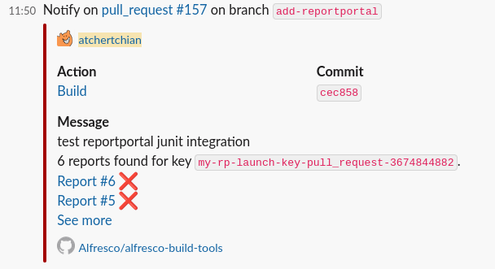

[](https://github.com/Alfresco/alfresco-build-tools/releases/latest)
[](https://github.com/Alfresco/alfresco-build-tools/graphs/contributors)

This repository contains shared/reusable CI configurations for GitHub Actions to serve the repositories of the Alfresco org but virtually usable by everyone.

For security-related topics of GitHub Actions, see the [Security section](security.md).

For terraform-related topics of GitHub Actions, see the [Terraform section](terraform.md).

For pre-commit hooks documentation, see the [Pre-commit Hooks section](pre-commit-hooks.md).

Here follows the list of GitHub Actions topics available in the current document:

- [GitHub Actions](#github-actions)
  - [Java setup](#java-setup)
    - [Setup JDK](#setup-jdk)
    - [Setup Maven Credentials](#setup-maven-credentials)
    - [Setup Maven Build Options](#setup-maven-build-options)
- [GitHub Actions provided by community](#github-actions-provided-by-community)
  - [Comment a PR](#comment-a-pr)
  - [Docker build and push](#docker-build-and-push)
  - [Docker login](#docker-login)
  - [EC2 GitHub runner](#ec2-github-runner)
  - [Generate Dependabot Glob Action](#generate-dependabot-glob-action)
  - [Git commit and push](#git-commit-and-push)
  - [pmd](#pmd)
  - [Retry failing step](#retry-failing-step)
  - [SSH debug](#ssh-debug)
  - [Triggering a workflow in another repository](#triggering-a-workflow-in-another-repository)
  - [Retry an action](#retry-an-action)
  - [Actions SHA pinning](#actions-sha-pinning)
- [GitHub Actions provided by us](#github-actions-provided-by-us)
  - [automate-propagation](#automate-propagation)
  - [calculate-next-internal-version](#calculate-next-internal-version)
  - [configure-git-author](#configure-git-author)
  - [dependabot-missing-actions-check](#dependabot-missing-actions-check)
  - [dbp-charts](#dbp-charts)
  - [dispatch-resume-workflow](#dispatch-resume-workflow)
  - [docker-dump-containers-logs](#docker-dump-containers-logs)
  - [docker-scan-image-dirs](#docker-scan-image-dirs)
  - [enforce-pr-conventions](#enforce-pr-conventions)
  - [env-load-from-yaml](#env-load-from-yaml)
  - [free-hosted-runner-disk-space](#free-hosted-runner-disk-space)
  - [get-branch-name](#get-branch-name)
  - [get-build-info](#get-build-info)
  - [gh-cache-cleanup-on-merge](#gh-cache-cleanup-on-merge)
  - [git-check-existing-tag](#git-check-existing-tag)
  - [get-commit-message](#get-commit-message)
  - [git-commit-changes](#git-commit-changes)
  - [git-latest-tag](#git-latest-tag)
  - [github-check-upcoming-runs](#github-check-upcoming-runs)
  - [github-deployment-create](#github-deployment-create)
  - [github-deployment-status-update](#github-deployment-status-update)
  - [github-deployments-delete](#github-deployments-delete)
  - [github-download-file](#github-download-file)
  - [github-https-auth](#github-https-auth)
  - [github-list-changes](#github-list-changes)
  - [github-pr-check-metadata](#github-pr-check-metadata)
  - [github-require-secrets](#github-require-secrets)
  - [github-trigger-approved-pr](#github-trigger-approved-pr)
  - [github-trigger-labeled-pr](#github-trigger-labeled-pr)
  - [helm-build-chart](#helm-build-chart)
  - [helm-integration-tests](#helm-integration-tests)
  - [helm-package-chart](#helm-package-chart)
  - [helm-parse-next-release](#helm-parse-next-release)
  - [helm-publish-chart](#helm-publish-chart)
  - [helm-release-and-publish](#helm-release-and-publish)
  - [helm-template-yamllint](#helm-template-yamllint)
  - [helm-plugin](#helm-plugin)
  - [helm-update-chart-version](#helm-update-chart-version)
  - [install-galaxy-deps](#install-galaxy-deps)
  - [install-ubuntu-default-tools](#install-ubuntu-default-tools)
  - [jx-updatebot-pr](#jx-updatebot-pr)
  - [kubectl-keep-nslogs](#kubectl-keep-nslogs)
  - [kubectl-wait](#kubectl-wait)
  - [load-release-descriptor](#load-release-descriptor)
  - [maven-configure](#maven-configure)
  - [maven-dependency-scan](#maven-dependency-scan)
    - [`restore-artifact-pattern` option](#restore-artifact-pattern-option)
  - [maven-build](#maven-build)
    - [Jacoco report options](#jacoco-report-options)
  - [maven-build-and-tag](#maven-build-and-tag)
    - [Preview option for maven-build-and-tag](#preview-option-for-maven-build-and-tag)
    - [Option to skip tests for maven-build-and-tag](#option-to-skip-tests-for-maven-build-and-tag)
  - [maven-deploy-file](#maven-deploy-file)
  - [maven-release](#maven-release)
  - [maven-tag](#maven-tag)
  - [maven-update-pom-version](#maven-update-pom-version)
  - [md-toc](#md-toc)
  - [nexus-move-artifacts](#nexus-move-artifacts)
  - [pre-commit](#pre-commit)
  - [process-coverage-report](#process-coverage-report)
  - [pipenv](#pipenv)
  - [rancher](#rancher)
  - [release-notes-aggregator](#release-notes-aggregator)
  - [reportportal-prepare](#reportportal-prepare)
  - [reportportal-summarize](#reportportal-summarize)
  - [resolve-preview-name](#resolve-preview-name)
  - [send-slack-notification-slow-job](#send-slack-notification-slow-job)
  - [send-slack-notification](#send-slack-notification)
  - [send-teams-notification](#send-teams-notification)
    - [Mentions](#mentions)
  - [setup-checkov](#setup-checkov)
  - [setup-docker](#setup-docker)
  - [setup-fluxcli](#setup-fluxcli)
  - [setup-github-release-binary](#setup-github-release-binary)
  - [setup-helm-docs](#setup-helm-docs)
  - [setup-java-build](#setup-java-build)
  - [setup-jx-release-version](#setup-jx-release-version)
  - [setup-kcadm](#setup-kcadm)
  - [setup-kind](#setup-kind)
  - [setup-kubepug](#setup-kubepug)
  - [setup-pysemver](#setup-pysemver)
  - [setup-rancher-cli](#setup-rancher-cli)
  - [setup-terraform-docs](#setup-terraform-docs)
  - [setup-updatebot](#setup-updatebot)
  - [setup-updatecli](#setup-updatecli)
  - [slack-file-upload](#slack-file-upload)
  - [sonar-scan-on-built-project](#sonar-scan-on-built-project)
  - [sonar-scanner](#sonar-scanner)
  - [update-deployment-runtime-versions](#update-deployment-runtime-versions)
  - [update-pom-to-next-pre-release](#update-pom-to-next-pre-release)
  - [update-project-base-tag](#update-project-base-tag)
  - [validate-maven-versions](#validate-maven-versions)
  - [veracode](#veracode)
  - [xvfb-record](#xvfb-record)
  - [Nuxeo related actions](#nuxeo-related-actions)
    - [nos-publish](#nos-publish)
    - [nuxeo-docker-build](#nuxeo-docker-build)
- [Reusable workflows provided by us](#reusable-workflows-provided-by-us)
  - [branch-promotion-prs](#branch-promotion-prs)
  - [helm-publish-new-package-version](#helm-publish-new-package-version)
  - [reusable-release](#reusable-release)
  - [terraform](#terraform)
- [Cookbook](#cookbook)
  - [Conditional job/step depending on PR labels](#conditional-jobstep-depending-on-pr-labels)
  - [Serialize pull request builds](#serialize-pull-request-builds)
  - [Expiring tags for quay.io images](#expiring-tags-for-quayio-images)
  - [Running a dependabot PR workflow only when pull request is approved](#running-a-dependabot-pr-workflow-only-when-pull-request-is-approved)
    - [Using the pr-review-check reusable workflow](#using-the-pr-review-check-reusable-workflow)
    - [Manual job condition approach](#manual-job-condition-approach)
  - [Automating github-actions updates](#automating-github-actions-updates)
- [Known issues](#known-issues)
  - [realpath not available under macosx](#realpath-not-available-under-macosx)

## GitHub Actions

### Java setup

#### Setup JDK

[actions/setup-java](https://github.com/actions/setup-java) should be used, here is a sample usage:

```yml
      - name: Set up JDK 11
        uses: actions/setup-java@v3
        with:
          java-version: '11'
          distribution: 'temurin'
          cache: 'maven'
```

#### Setup Maven Credentials

Credentials should be already available via organization secrets, otherwise they would need to be
provided as repository secrets.

Since repositories hold a `settings.xml` file at the root with environment variables `MAVEN_USERNAME` and
`MAVEN_USERNAME` filled for the username and password, only a mapping of variables is needed:

```yml
      - name: Build with Maven
        run: mvn --settings settings.xml [...]
        env:
          MAVEN_USERNAME: ${{ secrets.NEXUS_USERNAME }}
          MAVEN_USERNAME: ${{ secrets.NEXUS_PASSWORD }}
```

Alternatively, the [s4u/maven-settings-action](https://github.com/s4u/maven-settings-action) could be used.

#### Setup Maven Build Options

Maven build options can be shared for a given step on the mvn command line, or extracted as environment variables.

Sample usage:

```yml
      - name: Test with Maven
        run: mvn verify ${{ env.MAVEN_CLI_OPTS }}
        env:
          MAVEN_CLI_OPTS: --show-version -Ddocker.skip -Dlogging.root.level=off -Dspring.main.banner-mode=off
```

When deploying in a second step, these variables can be shared:

```yml
env:
  MAVEN_CLI_OPTS: --show-version -Dlogging.root.level=off -Dspring.main.banner-mode=off

[...]

      - name: Test with Maven
        run: mvn verify ${{ env.MAVEN_CLI_OPTS }}
      - name: Deploy with Maven
        run: mvn deploy ${{ env.MAVEN_CLI_OPTS }} -DskipTests
```

Here is a sample way to extract a branch name that would be used for docker images built with the `build-and-push-docker-images.sh` script, although using the [dedicated action](#docker-build-and-push) can also be
useful.

```yml
      - name: Set stripped branch name as tag
        run: echo "STRIPPED_TAG=$(echo ${{ github.ref_name }} | sed -e 's/[^-_.[:alnum:]]/_/g')" >> $GITHUB_ENV
      - name: Docker Build and Push
        run: sh ./build-and-push-docker-images.sh
        env:
          TAG: ${{ env.STRIPPED_TAG }}
```

## GitHub Actions provided by community

### Comment a PR

To improve developer experience and make build results like reports or test
results more accessible, link/post them as a comment on the PR. Any subsequent
re-run will update the comment to keep the information current and avoid
clutter.

```yml
    - name: Find Comment
      uses: peter-evans/find-comment@3eae4d37986fb5a8592848f6a574fdf654e61f9e # v3.1.0
      id: fc
      with:
        issue-number: ${{ github.event.pull_request.number }}
        comment-author: 'github-actions[bot]'
        body-includes: Build output

    - name: Create or update comment
      uses: peter-evans/create-or-update-comment@71345be0265236311c031f5c7866368bd1eff043 # v4.0.0
      with:
        comment-id: ${{ steps.fc.outputs.comment-id }}
        issue-number: ${{ github.event.pull_request.number }}
        body: |
          Build output
          ${{ steps.build.outputs.build-log }}
        edit-mode: replace
```

Upstream documentation at
[peter-evans/create-or-update-comment](https://github.com/peter-evans/create-or-update-comment).

### Docker build and push

Consider using this official [Docker action](https://github.com/marketplace/actions/build-and-push-docker-images) for building and pushing containers instead of doing it by hand, for buildx support, caching and more.

### Docker login

Credentials should be already available via organization secrets, otherwise they would need to be
provided as repository secrets.

```yml
      - name: Login to Docker Hub
        uses: docker/login-action@v2
        with:
          username: ${{ secrets.DOCKER_USERNAME }}
          password: ${{ secrets.DOCKER_PASSWORD }}

      - name: Login to Quay.io
        uses: docker/login-action@v2
        with:
          registry: quay.io
          username: ${{ secrets.QUAY_USERNAME }}
          password: ${{ secrets.QUAY_PASSWORD }}
```

### EC2 GitHub runner

[machulav/ec2-github-runner](https://github.com/machulav/ec2-github-runner) can be used to start EC2 [self-hosted runners](https://docs.github.com/en/actions/hosting-your-own-runners). An on-demand EC2 runner can be created, set-up, used to run a required process and finally destroyed - on the fly.

### Generate Dependabot Glob Action

[generate-dependabot-glob-action](https://github.com/Makeshift/generate-dependabot-glob-action) creates a dependabot.yml file from a user-provided template by replacing instances of directory globs with an array of objects matching that glob, with all the other keys copied.
For example, the following template:

```yml
  - package-ecosystem: 'docker'
    directory: '/test/docker/*/Dockerfile*'
    schedule:
      interval: 'daily'
```

Will result in:

```yml
  - package-ecosystem: 'docker'
    directory: '/test/docker/container_1/'
    schedule:
      interval: 'daily'
  - package-ecosystem: 'docker'
    directory: '/test/docker/container_2/'
    schedule:
      interval: 'daily'
  - package-ecosystem: 'docker'
    directory: '/test/docker/weird_dockerfile/'
    schedule:
      interval: 'daily'
```

### Git commit and push

[stefanzweifel/git-auto-commit-action](https://github.com/stefanzweifel/git-auto-commit-action)
can be used to automatically commit and push changed files back to GitHub.

We are also using it inside the [pre-commit](#pre-commit) action for the auto-commit feature.

### pmd

[Yet Another PMD Scan](https://github.com/Alfresco/ya-pmd-scan) is a GitHub Action primarily for Alfresco repositories. It is a bit more involved than most of the actions in this repository and so has been split out into a repository of its own.

The action runs the [PMD](https://pmd.github.io/) static analysis tool to look for common programming flaws in files modified by PRs.

### Retry failing step

[This action](https://github.com/nick-fields/retry) retries an Action step on failure or timeout. Useful for unstable commands or that relies on remote resources that can be flaky sometimes.

### SSH debug

GitHub doesn't provide any native support for SSH debug access to builds.

To debug a build is necessary to add when needed a step like the following in
the workflow:

```yml
    - name: Setup tmate session
      uses: mxschmitt/action-tmate@v3
      with:
        # provide access to SSH user that triggered the build
        limit-access-to-actor: true
```

You can also run the step on-demand with a manually triggered build by adding
the `workflow_dispatch` event together with a boolean input:

```yaml
on:
  workflow_dispatch:
    inputs:
      debug_enabled:
        description: Enable SSH debug
        type: boolean
        required: false
        default: false
```

and then invoke the action step conditionally based on this event and input
value:

```yaml
    steps:
    - uses: actions/checkout@v3
    - name: Setup tmate session
      # run only when explicitly requested
      if: ${{ github.event_name == 'workflow_dispatch' && inputs.debug_enabled }}
      uses: mxschmitt/action-tmate@v3
      with:
        # provide access to SSH user that triggered the build
        limit-access-to-actor: true
      # automatically terminate after a given timeout
      timeout-minutes: 30
```

When executing that step, the job will block. If you want to continue with the
following steps, just create a file named `continue` in the current workspace
folder:

```sh
touch continue
```

Please be aware that when the last command of the job finish, also the tmate
session will be terminated automatically, so you may want to add at the end of
the workflow a step like:

```yaml
    # wait for 5 minutes before exiting
    - run: sleep 300
```

### Triggering a workflow in another repository

[actions/github-script](https://github.com/actions/github-script) can be used, here is a sample:

```yml
      - name: Trigger Downstream Builds
        if: steps.is_default_branch.outputs.result == 'true'
        uses: actions/github-script@v5
        with:
          github-token: ${{ secrets.BOT_GITHUB_TOKEN }}
          script: |
            await github.rest.actions.createWorkflowDispatch({
              owner: 'Alfresco',
              repo: 'alfresco-process-connector-services',
              workflow_id: 'build.yml',
              ref: 'develop'
            });
```

Note that this requires using a dedicated token.

Also, the triggered workflow should allow workflow dispatch in its definition (and this configuration should be setup
on the default branch):

```yml
on:
  # allows triggering workflow manually or from other jobs
  workflow_dispatch:
```

### Retry an action

To retry a github action step or command on failure, here is an example -

```yml
      - uses: Wandalen/wretry.action@e68c23e6309f2871ca8ae4763e7629b9c258e1ea # v3.8.0
        with:
        action: actions/setup-node@2.3.0
        with: |
          node-version: 14.x
          architecture: x64
        attempt_limit: 3
        attempt_delay: 2000
```

Please visit [wretry.action](https://github.com/Wandalen/wretry.action) for more examples of how to use this action

### Actions SHA pinning

To ensure the security and integrity of your GitHub Actions workflows, it's
recommended to pin third-party actions to a specific commit SHA. This prevents unexpected
changes in the action's code from affecting your workflows, until the upstream project
starts using [Immutable releases](https://docs.github.com/en/code-security/concepts/supply-chain-security/immutable-releases).

See [github-actions-ensure-sha-pinned-actions](https://github.com/hyland/github-actions-ensure-sha-pinned-actions),
available via pre-commit as well.

## GitHub Actions provided by us

### automate-propagation

Handles automated approval and merge of propagation PRs used to handle alpha releases on builds.

This action requires a dedicated secret (named `BOT_GITHUB_TOKEN` in the sample) to setup the "auto-merge" behavior: the default `GITHUB_TOKEN` is not used in this case, otherwise a build would not be triggered when the PR is merged, [see reference solution](https://david.gardiner.net.au/2021/07/github-actions-not-running.html).

Another token is also needed to handled approval. It can be the default `GITHUB_TOKEN`, but it cannot be the same one that is used for auto-merge behavior as the user might match the creator of the PR (and auto-approval of a PR is not allowed).

```yaml
    - uses: Alfresco/alfresco-build-tools/.github/actions/automate-propagation@v14.0.0
      with:
        auto-merge-token: ${{ secrets.BOT_GITHUB_TOKEN }}
        approval-token: ${{ secrets.GITHUB_TOKEN }}
```

### calculate-next-internal-version

Calculate next internal version based on existing tags

```yaml
      - uses: Alfresco/alfresco-build-tools/.github/actions/calculate-next-internal-version@v14.0.0
        with:
          next-version: 1.2.3
```

### configure-git-author

Configures the git username and email to associate commits with the provided identity

```yaml
      - uses: Alfresco/alfresco-build-tools/.github/actions/configure-git-author@v14.0.0
        with:
          username: ${{ vars.BOT_GITHUB_USERNAME }}
          email: ${{ vars.BOT_GITHUB_EMAIL }}
          global: true
```

The two vars in the previous snippet are [workflow configuration variables](https://github.blog/changelog/2023-01-10-github-actions-support-for-configuration-variables-in-workflows/) that can be created at organization level and shared across different repositories.

### dependabot-missing-actions-check

This action checks if all GitHub Actions are listed in the
`.github/dependabot.yml` file.

This is a workaround for an old [dependabot
issue](https://github.com/dependabot/dependabot-core/issues/6345) when all
actions were needed to be listed explicitly to be updated.

Nowdays, dependabot supports glob patterns, so this action is not strictly necessary anymore, see [Automating github-actions updates](#automating-github-actions-updates) in the [Cookbook](#cookbook) section for more details.

```yaml
      - uses: Alfresco/alfresco-build-tools/.github/actions/dependabot-missing-actions-check@v14.0.0
```

### dbp-charts

A collection of actions used in Alfresco acs-deployment repository to manage Helm charts (mostly deprecated).

See [dbp-charts](https://github.com/Alfresco/alfresco-build-tools/tree/master/.github/actions/dbp-charts) for more details.

### dispatch-resume-workflow

Ability to dispatch or resume an existing workflow and wait for its completion.

```yaml
      - uses: Alfresco/alfresco-build-tools/.github/actions/dispatch-resume-workflow@v14.0.0
        with:
          workflow: workflow-name.yml
          run-id: existing_run_number (optional)
```

### docker-dump-containers-logs

Dumps Docker containers logs. Each container's log will be stored in a separate `<container_name>.log` file. All files will be archived by default under `containers-logs-<job_id>-<job_retry_number>-<timestamp>.tar.gz` and will be available to download via the workflow's summary page.
It is also possible to specify the output archive name when providing the `output-archive-name` parameter.

```yaml
      - uses: Alfresco/alfresco-build-tools/.github/actions/docker-dump-containers-logs@v14.0.0
```

### docker-scan-image-dirs

Scan the directories were the Dockerfiles are to feed the scanner.

```yaml
      - uses: Alfresco/alfresco-build-tools/.github/actions/docker-scan-image-dirs@v14.0.0
```

### enforce-pr-conventions

Checks if the branch name and pull request title follow conventions.

This action is only valid for workflows triggered by the `pull_request` event.

Enforce PR conventions with a Jira ticket reference, assuming the Jira project key is `JKEY`:

```yaml
      - uses: Alfresco/alfresco-build-tools/.github/actions/enforce-pr-conventions@v14.0.0
        with:
          jira-project-key: JKEY
```

In this case, the default regular expressions will be applied.
Multiple project keys can be defined, separated by "|".

If default regular expressions do not match the need, they can also be defined:

```yaml
      - uses: Alfresco/alfresco-build-tools/.github/actions/enforce-pr-conventions@v14.0.0
        with:
          valid-branch-regex: "^(feature|test|tmp)\/JKEY-[0-9]+-[A-Za-z0-9._-]+$"
          valid-pr-title-regex: "^JKEY-[0-9]+ [A-Za-z]{1}.*$"
```

To exempt specific branch names from *both* checks, the optional input parameter called `whitelist-branches` can be utilized. If there are multiple branches to be excluded, they can be written as one branch name per line.

```yaml
      - uses: Alfresco/alfresco-build-tools/.github/actions/enforce-pr-conventions@v14.0.0
        with:
          jira-project-key: JKEY
          whitelist-branches: |-
            ABC-1234-branch
            XYZ-5678-branch
```

The inputs `jira-project-key`, `valid-branch-regex` and `valid-pr-title-regex` are optional: if `valid-branch-regex` or `valid-pr-title-regex` are not provided, the action will consume `jira-project-key` to generate the default regex.

**Default regex for Branch name**: `"^(revert-.*|copilot.*|(improvement|fix|feature|test|tmp)\/($JIRA_KEY)-[0-9]+[_-]{1}[A-Za-z0-9._-]+)$"`

If the branch name starts with `(revert-)` it will be considered valid.

If the branch name starts with `copilot` it will be considered valid.

Examples:

✅ improvement/JKEY-12345-the-topic-of-the-branch

✅ revert-123-improvement/JKEY-12345-the-topic-of-the-branch

✅ copilot/topic-of-the-branch

❌ dev-uname-jkey-12345

**Default regex for PR title:**: `"^([Rr]evert.*)|^($JIRA_KEY)-[0-9]+ [A-Z]{1}.*$"`

If the PR title starts with "Revert", it will be considered valid.

If the PR title does not start with "Revert", it will be checked against `^($JIRA_KEY)-[0-9]+ [A-Z]{1}[A-Za-z].*$` regex.

Examples:

✅ JKEY-12345 The title of the Merge Commit

✅ Revert "JKEY-12345 The title of the Merge Commit"

❌ [JKEY-12345] - The title of the Merge Commit

❌ JKEY-12345 the title of the Merge Commit

### env-load-from-yaml

Load environment variables from a yaml file

```yaml
      - uses: Alfresco/alfresco-build-tools/.github/actions/env-load-from-yaml@v14.0.0
        with:
          ignore_regex: ^BRANCH_NAME=.*
          yml_path: .travis/env.yml
```

### free-hosted-runner-disk-space

Frees up disk space on GitHub hosted runners by removing unnecessary files and
directories. Hosted runners bundle a lot of [pre-installed
software](https://github.com/actions/runner-images), some of which may not be
needed for your specific workflow.

It's usually a good idea to run this action at the very beginning of your job to
maximize the amount of freed up space for the rest of your workflow steps.

```yaml
      - uses: Alfresco/alfresco-build-tools/.github/actions/free-hosted-runner-disk-space@v14.0.0
```

By default, it will remove the following SDKs and tools:

- Android
- Dotnet
- Haskell
- CodeQL
- Swift
- Powershell
- Tools cache (most common versions of setup-something actions)

You can override the default behavior by adding one or more of the following inputs:

```yaml
      - uses: Alfresco/alfresco-build-tools/.github/actions/free-hosted-runner-disk-space@v14.0.0
        with:
          remove-android: false
          remove-dotnet: false
          remove-haskell: false
          remove-codeql: false
          remove-swift: false
          remove-powershell: false
          remove-tools-cache: false
```

Since GitHub hosted runners use Azure VMs which provide a local SSD mount under
`/mnt` by default, you can get additional space by enabling the optional
`merge-disk-volumes` input. This feature is brought by the community action
[maximize-build-space](https://github.com/easimon/maximize-build-space). This
will expand the root filesystem leveraging the extra space available under `/mnt`.

```yaml
      - uses: Alfresco/alfresco-build-tools/.github/actions/free-hosted-runner-disk-space@v14.0.0
        with:
          merge-disk-volumes: true
          build-mount-path: '/var/lib/docker/' # optional - default to GITHUB_WORKSPACE
          root-reserve-mb: 12288  # optional
          temp-reserve-mb: 100  # optional
          swap-size-mb: 1024  # optional
```

There is an additional input `diagnose-top-offenders-enabled` which when set to `true` will
run a disk usage analysis and print the top offenders before and after the cleanup.

```yaml
      - uses: Alfresco/alfresco-build-tools/.github/actions/free-hosted-runner-disk-space@v14.0.0
        with:
          diagnose-top-offenders-enabled: true
```

### get-branch-name

Loads the name of the branch on which the action was called into `BRANCH_NAME` environment variable

```yaml
      - uses: Alfresco/alfresco-build-tools/.github/actions/get-branch-name@v14.0.0
```

### get-build-info

[get-build-info](https://github.com/Alfresco/alfresco-build-tools/blob/master/.github/actions/get-build-info/action.yml) loads build-related info into the runner env, in the form of generically named variables that are not necessarily specific to GitHub.

```yaml
      - uses: Alfresco/alfresco-build-tools/.github/actions/get-build-info@v14.0.0
```

### gh-cache-cleanup-on-merge

Performs the cleanup of all cache entries related with already closed PR

```yaml
name: Cleanup caches for work branch
on:
  pull_request:
    types:
      - closed

jobs:
  cleanup:
    runs-on: ubuntu-latest
    steps:
      - uses: Alfresco/alfresco-build-tools/.github/actions/gh-cache-cleanup-on-merge@v14.0.0
        with:
          token: ${{ secrets.GH_TOKEN }}
```

### git-check-existing-tag

Checks if a tag with the given name already exists for this remote repository. Returns the output named `exists` with value `'true'` or `'false'`.

```yaml
    - uses: Alfresco/alfresco-build-tools/.github/actions/git-check-existing-tag@v14.0.0
      with:
        tag: 1.0.0
```

### get-commit-message

Loads the content of the last commit message that triggered the action into `COMMIT_MESSAGE` environment variable
This action requires a checkout with fetch-depth option as follow:

```yaml

      - uses: actions/checkout@v3
        with:
          fetch-depth: 0
      - uses: Alfresco/alfresco-build-tools/.github/actions/get-commit-message@v14.0.0
```

If you only need the commit header (first line), you can set the `header-only` input to `true`:

```yaml
      - uses: Alfresco/alfresco-build-tools/.github/actions/get-commit-message@v14.0.0
        with:
          header-only: true
```

### git-commit-changes

Commits local changes after configuring git user and showing the status of what is going be committed.
If `skip-if-no-changes` input is set to `true` then an empty commit will not be committed at all.

```yaml
    - uses: Alfresco/alfresco-build-tools/.github/actions/git-commit-changes@v14.0.0
      with:
        username: ${{ secrets.BOT_GITHUB_USERNAME }}
        add-options: -u
        commit-message: "My commit message"
```

> Consider using [git-commit-and-push](#git-commit-and-push) instead which
> provides additional features.

### git-latest-tag

Gets the latest tag and commit sha for the given pattern. The result is returned in the output named `tag` and `tag_long_sha`.

```yaml
      - uses: Alfresco/alfresco-build-tools/.github/actions/git-latest-tag@v14.0.0
        with:
          pattern: 1.0.0-alpha*
```

### github-check-upcoming-runs

This action fails the current run if it detects that another run if upcoming on the same branch.
If the upcoming run is cancelled, its re-run is triggered.

This is useful when several events might trigger the same long workflow execution that cannot be cancelled (typically for some system tests, where PR check is triggered on PR `opened` or `labeled`, which can create multiple events in a short time on automated PR creation with labels).

Checking upcoming runs before running them, eventually favoring the latest run to retain the status on PR check, is then helpful, because, as [stated in the GitHub documentation](https://docs.github.com/en/actions/using-jobs/using-concurrency#using-concurrency-in-different-scenarios):

> Ordering is not guaranteed for jobs or workflow runs using concurrency groups. Jobs or workflow runs in the same
> concurrency group are handled in an arbitrary order.

With proper concurrency logic in place, the latest run might have been cancelled: this action also triggers a rerun before exiting in failure. The outcome `exit` can help determining if exit on error was thrown.

```yaml
      - uses: Alfresco/alfresco-build-tools/.github/actions/github-check-upcoming-runs@v14.0.0
        with:
          github-token: ${{ secrets.MY_GITHUB_TOKEN }}
          workflow: my-workflow.yml
```

### github-deployment-create

### github-deployment-status-update

These actions create a [GitHub deployment](https://docs.github.com/en/rest/deployments/deployments) and allow updating its status. That can be useful to track progression on a workflow pipeline.

On creation, an optional git sha can be provided, otherwise the sha of the commit that triggered the workflow is used.

Sample usage:

```yaml
permissions:
  deployments: write # This is required for deployment statuses management

jobs:
  job:
    runs-on: ubuntu-latest
    steps:
      - name: Create Deployment
        id: create-deployment
        uses: Alfresco/alfresco-build-tools/.github/actions/github-deployment-create@v14.0.0
        with:
          github-token: ${{ secrets.GITHUB_TOKEN }}
          environment: my_gh_environment
          state: in_progress

      - name: Other Steps

      - name: Update Deployment State to failure
        if: failure() && steps.create-deployment.outcome == 'success'
        uses: Alfresco/alfresco-build-tools/.github/actions/github-deployment-status-update@v14.0.0
        with:
          github-token: ${{ secrets.GITHUB_TOKEN }}
          deployment-id: ${{ steps.create-deployment.outputs.id }}
          state: failure

      - name: Update Deployment State to success
        uses: Alfresco/alfresco-build-tools/.github/actions/github-deployment-status-update@v14.0.0
        with:
          github-token: ${{ secrets.GITHUB_TOKEN }}
          deployment-id: ${{ steps.create-deployment.outputs.id }}
          state: success
```

### github-deployments-delete

Deletes all GitHub deployments on a given branch.
Used as workaround to delete the flood of messages visible on some PRs where environments are leveraged but deployments are not.

Sample usage:

```yaml
    permissions:
      deployments: write # This is required for deployment statuses management

    steps:
      - uses: Alfresco/alfresco-build-tools/.github/actions/github-deployments-delete@v14.0.0
        with:
          branch-name: ${{ github.head_ref }}
```

### github-download-file

Download a file from another repository.

```yaml
      - uses: Alfresco/alfresco-build-tools/.github/actions/download-file@v14.0.0
        with:
          github-token: ${{ secrets.BOT_GITHUB_TOKEN }}
          repository: "owner/repository"
          file-path: "subdirectory/file-name.json"
          target: "downloaded-file.json"
```

### github-https-auth

Use this action when running a workflow which clone a private repository over https.

```yaml
      - uses: Alfresco/alfresco-build-tools/.github/actions/github-https-auth@v14.0.0
        with:
          username: ${{ vars.BOT_GITHUB_USERNAME }}
          pat: ${{ secrets.BOT_GITHUB_TOKEN }}
```

### github-list-changes

List the changes in a pull request (`pull-request` event) or that were pushed to
a branch (`push` event).

This action requires a checkout with `fetch-depth: 0` option as follow:

```yaml
      - uses: actions/checkout@v3
        with:
          fetch-depth: 0
      - uses: Alfresco/alfresco-build-tools/.github/actions/github-list-changes@v14.0.0
        with:
          write-list-to-env: "true" # default "false"
```

The action outputs the list of changed files (one path per line) using the
output `all_changed_files` and optionally to the env variable
`GITHUB_MODIFIED_FILES`.

Optionally, it can also support `issue_comment` event for PRs, but it requires
providing a github token and checking out the merge commit:

```yaml
      - uses: actions/checkout@v3
        with:
          fetch-depth: 0
          ref: ${{ github.event_name == 'issue_comment' && format('refs/pull/{0}/merge', github.event.issue.number) || '' }}
      - uses: Alfresco/alfresco-build-tools/.github/actions/github-list-changes@v14.0.0
        with:
          github-token: ${{ secrets.GITHUB_TOKEN }}
```

### github-pr-check-metadata

This action helps checking, on a Pull Request, or on push caused by the merge of a Pull Request, who opened the PR and if it was holding a specific label.

This is typically useful for Dependabot PRs, where the label usually relates to the type of dependency update.

Sample usage:

```yaml

on:
  push:

jobs:
  check-dependabot:
    runs-on: ubuntu-latest
    steps:
      - name: dependabot check
        id: dependabot
        uses: Alfresco/alfresco-build-tools/.github/actions/github-pr-check-metadata@v14.0.0
        with:
          gh-token: ${{ secrets.GITHUB_TOKEN }}
          actor: 'dependabot[bot]'
          label: github_actions

  deploy:
    needs: check-dependabot
    if: steps.dependabot.outputs.result != 'true'
    runs-on: ubuntu-latest
    steps:
      - name: Deploy
        run: echo "Deploying..."
```

On this sample, if the commit was merged with a PR opened by Dependabot, **and** has the `github_actions` label, the action sets the `result` output to `true`.

The `deploy` job only runs if result is not true, so deploys are skipped when merging these PRs.

The main benefit is to save CI/CD resources and time by skipping unnecessary deploys for automated dependency updates that only affect GitHub Actions workflows.

### github-require-secrets

This action fails the current run if it detects that the secrets source is not enough for proper PR validation.

This is useful to stop a build early and cleanly, when validating dependabot PRs that do not have access to Dependabot secrets, or which are forks.

Good practices for proper validation of such PRs is to trigger the validation by labelling or setting the milestone on the PR, so that it is run with the user's credentials instead of having to share secrets with Dependabot.

See also sibling action [github-trigger-approved-pr](#github-trigger-approved-pr).

```yaml
on:
  pull_request:
    types:
      - opened
      - synchronize
      - reopened
      - milestoned

jobs:
  check:
    runs-on: ubuntu-latest
    steps:
      - uses: Alfresco/alfresco-build-tools/.github/actions/github-require-secrets@v14.0.0
        with:
          dependabot-error-message: "This PR requires additional validation, please set the milestone to 'Validating' or ask a reviewer to approve it."
```

### github-trigger-approved-pr

This action is typically helpful to trigger validation of Dependabot PRs, as well as setting up auto-merge, so that only a reviewer's approval is needed to merging such PR.

The corresponding workflow needs to be triggered by corresponding labeled or milestoned event.
This approach also allows to avoid re-triggering validations when the PR is already approved.

For Dependabot use case, that also allows following good security practices where secrets needed for the validation are not shared as Dependabot secrets.

It requires a dedicated secret (named `BOT_GITHUB_TOKEN` in the sample) to setup the "auto-merge" behavior: the default `GITHUB_TOKEN` is not used in this case, otherwise a build would not be triggered when the PR is merged, [see reference solution](https://david.gardiner.net.au/2021/07/github-actions-not-running.html).

See also sibling action [github-require-secrets](#github-require-secrets).

```yaml
on:
  pull_request_review:
    types:
      - submitted

jobs:
  check:
    runs-on: ubuntu-latest
    steps:
      - uses: Alfresco/alfresco-build-tools/.github/actions/github-trigger-approved-pr@v14.0.0
        with:
          github-token: ${{ secrets.BOT_GITHUB_TOKEN }}
          creator: dependabot[bot]
          milestone-on-approval: Validating
```

### github-trigger-labeled-pr

This action helps triggering events on a Pull Request when it is labeled with one of the specified labels.

The corresponding workflow needs to be triggered by corresponding milestoned event.
This approach allows to avoid re-triggering validations when any label is added to the PR, as the list of labels can be specified.

```yaml
on:
  pull_request:
    types:
      - labeled

env:
  TRIGGER_LABELS: '["CI", "preview", "skip-tests"]'

jobs:
  check:
    runs-on: ubuntu-latest
    steps:
      - uses: Alfresco/alfresco-build-tools/.github/actions/github-trigger-labeled-pr@v14.0.0
        with:
          github-token: ${{ secrets.BOT_GITHUB_TOKEN }}
          labels: ${{ env.TRIGGER_LABELS }}
          milestone: Validating
```

### helm-build-chart

Run `helm dep up` and `helm lint` on the specified chart

```yaml
      - uses: Alfresco/alfresco-build-tools/.github/actions/helm-build-chart@v14.0.0
        with:
          chart-dir: charts/common
```

### helm-integration-tests

Run `helm upgrade --dryn-run` on the specified chart

```yaml
      - name: Execute dry run
        uses: Alfresco/alfresco-build-tools/.github/actions/helm-integration-tests@v14.0.0
        with:
          chart-dir: ${{ env.CHART_DIR }}
          test-rancher-url: ${{ secrets.RANCHER2_URL }}
          test-rancher-access-key: ${{ secrets.RANCHER2_ACCESS_KEY }}
          test-rancher-secret-key: ${{ secrets.RANCHER2_SECRET_KEY }}
          test-cluster-name: ${{ env.TEST_CLUSTER_NAME }}
          test-namespace: ${{ env.TEST_NAMESPACE }}
```

### helm-package-chart

Packages a helm chart into a `.tgz` file and provides the name of the file produced in the output named `package-file`, and its path in the output named `package-file-path`.
The packaged file is also uploaded as an artifact and can be downloaded using `actions/download-artifact`.

```yaml
    - uses: Alfresco/alfresco-build-tools/.github/actions/helm-package-chart@v14.0.0
      id: package-helm-chart
      with:
        chart-dir: charts/common
```

### helm-parse-next-release

Parses the next main release version based on the content of Chart.yaml file. The result will be returned using the output named `next-release`.
The suffix `-SNAPSHOT` is removed. For instance, if the version attribute in the Chart.yaml file is `1.0.0-SNAPSHOT`, the result will be `1.0.0`

```yaml
      - uses: Alfresco/alfresco-build-tools/.github/actions/helm-parse-next-release@v14.0.0
        id: parse-next-release
        with:
          chart-dir: charts/common
```

### helm-publish-chart

Publishes a new helm chart package (`.tgz`) to a helm chart repository

```yaml
      - uses: Alfresco/alfresco-build-tools/.github/actions/helm-publish-chart@v14.0.0
        with:
          helm-charts-repo: Activiti/activiti-cloud-helm-charts
          helm-charts-repo-branch: gh-pages
          chart-package: ${{ steps.package-helm-chart.outputs.package-file-path }}
          token: ${{ secrets.BOT_GITHUB_TOKEN}}
```

### helm-release-and-publish

Releases a new version of a helm chart and publishes it to a helm repository

```yaml
      - uses: Alfresco/alfresco-build-tools/.github/actions/helm-release-and-publish@v14.0.0
        with:
          version: 1.0.0
          chart-dir: charts/common
          chart-repository-dir: ${{ env.COMMON_CHART_DIR }}
          helm-repository: Activiti/activiti-cloud-helm-charts
          helm-repository-branch: gh-pages
          helm-repository-token: ${{ secrets.GITHUB_TOKEN }}
          git-username:  ${{ secrets.GITHUB_USERNAME }}
```

### helm-template-yamllint

Render Helm chart templates and pipe into yamllint, that can check for
duplicated keys and other inconsistencies that helm itself doesn't care of. The
action embed a
[yamllint](https://github.com/Alfresco/alfresco-build-tools/blob/master/.github/actions/helm-template-yamllint/.yamllint.yml)
configuration files that should be suitable for most use cases.

```yaml
      - uses: Alfresco/alfresco-build-tools/.github/actions/helm-template-yamllint@v14.0.0
        with:
          chart-dir: helm/my-chart # defaults to current working directory
          helm-options: --values tests/values/test_values.yaml --set persistence.enabled=false # to handle mandatory values or test different rendering
          yamllint-config-path: ./.yamllint.yaml # alternative path to yamllint config to override the default one
```

### helm-plugin

Install requested Helm plugin

```yaml
     - uses: >-
         Alfresco/alfresco-build-tools/.github/actions/helm-plugin@v14.0.0
       with:
         plugin_url: https://domain/path/to/
         plugin_version: v1.0.0
```

`plugin_version` can be skipped so the latest release of the plugin will be installed

### helm-update-chart-version

Updates `version` attribute inside `Chart.yaml` file:

```yaml
      - uses: Alfresco/alfresco-build-tools/.github/actions/helm-update-chart-version@v14.0.0
        with:
          new-version: 1.0.0
```

### install-galaxy-deps

Installs and cache ansible galaxy dependencies. When `pipenv` binary exists, installation command is prefixed with `pipenv run`.

```yaml
      - uses: Alfresco/alfresco-build-tools/.github/actions/install-galaxy-deps@v14.0.0
        with:
          cache-name: cache-name-default
          cache-version: 1
```

### install-ubuntu-default-tools

Install common Ubuntu tools such as docker, git, zip, unzip. Meant to be used on
top of self-hosted runners coming with vanilla ubuntu images or the latest arm64 runners.

```yaml
      - uses: Alfresco/alfresco-build-tools/.github/actions/install-ubuntu-default-tools@v14.0.0
        with:
          package-names-list: "postgresql-client" # optional packages to install
```

### jx-updatebot-pr

Create a Pull Request on each downstream repository using [jx-updatebot](https://github.com/jenkins-x-plugins/jx-updatebot).

Given `.jx/updatebot.yaml` spec in the `alfresco-modeling-service` project:

```yaml
apiVersion: updatebot.jenkins-x.io/v1alpha1
kind: UpdateConfig
spec:
  rules:
    - urls:
        - https://github.com/alfresco/alfresco-process-releases
      reusePullRequest: true
      changes:
        - regex:
            pattern: "version: (.*)"
            files:
              - "docker/quay.io/alfresco/alfresco-modeling-service.yml"
        - regex:
            pattern: "<alfresco-modeling-service.version>(.*)</alfresco-modeling-service.version>"
            files:
              - pom.xml
```

This action will promote alpha version to `alfresco-process-releases` repository via pull request. It will add new commit if there is an existing PR with matching `develop` label.

```yaml
      - name: Promote version
        uses: Alfresco/alfresco-build-tools/.github/actions/jx-updatebot-pr@v14.0.0
        with:
          version: ${{ steps.tag.outputs.version }}
          labels: develop
          pull-request-title: "promote(dep): update versions into ${{ github.ref_name }}"
          commit-title: "chore(dep): update ${{ github.repository }} version to ${{ steps.tag.outputs.version }}"
          base-branch-name: ${{ github.ref_name }}
          git-username: ${{ secrets.GIT_USERNAME }}
          git-token: ${{ secrets.GIT_TOKEN }}
          git-author-name: ${{ secrets.GIT_AUTHOR_NAME }}
          git-author-email: ${{ secrets.GIT_AUTHOR_EMAIL }}
```

### kubectl-keep-nslogs

This action allow to collect logs from pods if they are referenced in a deployment, a statefulset or a job.

```yaml
    - name: Upload pods logs
      if: always()
      uses: >-
        Alfresco/alfresco-build-tools/.github/actions/kubectl-keep-nslogs@v14.0.0
      with:
        namespace: mynsapp
        log_retention: 7
        log_name_identifier: myapp_v1
```

### kubectl-wait

Wait for k8s resources (usually pods) to be ready.

```yaml
    - name: Wait for pods to be ready
      uses: Alfresco/alfresco-build-tools/.github/actions/kubectl-wait@v14.0.0
      # with:
        # wait-timeout: 10m
        # wait-for-what: condition
        # wait-condition: Ready
        # wait-resource: pods
        # namespace: default
```

If your deployment relies on a Job that must finish before continuing, you’ll
need a different approach. This is because the Pod created by the Job briefly
reports a `Ready` status, which can cause `kubectl wait` to miss it. A more reliable
method is shown in the example below:

```yaml
      - name: Wait for deployments to be ready
        uses: Alfresco/alfresco-build-tools/.github/actions/kubectl-wait@v14.0.0
        with:
          wait-resource: deployments
          wait-condition: Available

      - name: Wait for statefulsets to be ready
        uses: Alfresco/alfresco-build-tools/.github/actions/kubectl-wait@v14.0.0
        with:
          wait-resource: sts
          wait-for-what: jsonpath
          wait-condition: "'{.status.readyReplicas}'=1"

      - name: Wait for jobs to be completed
        uses: Alfresco/alfresco-build-tools/.github/actions/kubectl-wait@v14.0.0
        with:
          wait-resource: jobs
          wait-condition: complete
```

### load-release-descriptor

Used to release Activiti Projects. Load release information from release.yaml file.

```yaml
      - uses: Alfresco/alfresco-build-tools/.github/actions/load-release-descriptor@v14.0.0
        id: load-descriptor
        with:
          release-descriptor: release.yaml
```

### maven-configure

Set up Java and Maven version and compute common maven options including settings.xml to be used. It also restores Maven cache.

```yaml
      - uses: Alfresco/alfresco-build-tools/.github/actions/maven-configure@v14.0.0
        with:
          java-version: '21'
          maven-version: '3.8.8'
```

### maven-dependency-scan

Create the project Dependency Graph

```yaml
- uses: Alfresco/alfresco-build-tools/.github/actions/maven-dependency-scan@v14.0.0
  with:
    restore-artifact-pattern: 'm2*'
    restore-artifact-path: '~./m2/com/groupId'
    java-version: '21'
    maven-version: '3.8.8'
    maven-args: '--settings settings.xml'
    maven-username: ${{ secrets.MAVEN_USERNAME }}
    maven-password: ${{ secrets.MAVEN_PASSWORD }}
    ghcr-username: ${{ secrets.GHCR_USERNAME }}
    ghcr-password: ${{ secrets.GHCR_PASSWORD }}
```

#### `restore-artifact-pattern` option

Allow restoring artifacts from an earlier job to avoid attempts to download them from remote. To be used alongside with the option `restore-artifact-path`
to specify the path where the artifacts are stored.

### maven-build

Builds a maven project using the provided command.

```yaml
      - uses: Alfresco/alfresco-build-tools/.github/actions/maven-build@v14.0.0
        with:
          java-version: '21'
          maven-command: 'verify'
          maven-resolver-transport-options: '-Dmaven.wagon.http.pool=false'
          maven-username: ${{ secrets.MAVEN_USERNAME }}
          maven-password: ${{ secrets.MAVEN_PASSWORD }}
          maven-version: '3.8.8'
          quay-username: ${{ secrets.QUAY_USERNAME }}
          quay-password: ${{ secrets.QUAY_PASSWORD }}
          ghcr-username: ${{ secrets.GHCR_USERNAME }}
          ghcr-password: ${{ secrets.GHCR_PASSWORD }}
          docker-username: ${{ secrets.DOCKER_USERNAME }}
          docker-password: ${{ secrets.DOCKER_PASSWORD }}
          jacoco-report-name: 'jacoco-report'
          target-folder-upload-name: 'build-artifacts'
          m2-current-build-upload-name: 'm2-artifacts'
```

#### Jacoco report options

If the inputs `jacoco-report-name`, `target-folder-upload-name` and `m2-current-build-upload-name` are provided,
it also generates aggregated coverage reports and makes them available as build artifact for a next job processing it. It's typically followed by a job containing a step
with the action `sonar-scan-on-built-project`.

### maven-build-and-tag

Check out, builds a maven project and docker images, generating a new alpha version for it on push events:

- publish maven artifacts to Nexus
- push docker images to quay.io
- create GitHub tag for the new alpha release

```yaml
    outputs:
      version: ${{ steps.build-and-tag.outputs.version }}
      skip-tests: ${{ steps.build-and-tag.outputs.skip-tests }}
    steps:
      - uses: Alfresco/alfresco-build-tools/.github/actions/maven-build-and-tag@v14.0.0
        id: build-and-tag
        with:
          maven-username: ${{ secrets.NEXUS_USERNAME }}
          maven-password: ${{ secrets.NEXUS_PASSWORD }}
          quay-username: ${{ secrets.QUAY_USERNAME }}
          quay-password: ${{ secrets.QUAY_PASSWORD }}
          docker-username: ${{ secrets.DOCKER_USERNAME }}
          docker-password: ${{ secrets.DOCKER_PASSWORD }}
          git-username: ${{ secrets.BOT_GITHUB_USERNAME }}
```

#### Preview option for maven-build-and-tag

There is a possibility to publish snapshot maven artifacts and docker images from an open PR.
In order to use it specify `preview-label` input (or use default `preview`). Create a PR with the `preview-label` label.
The created maven artifacts and docker images will be tagged as `0.0.1-$GITHUB_PR_NUMBER-SNAPSHOT`.

#### Option to skip tests for maven-build-and-tag

There is a possibility to skip Unit and Integration Tests during build for an open PR.
In order to use it specify `skip-tests-label` input (or use default `skip-tests`). Create a PR with the `skip-tests` label.
A PR should not be merged if tests are skpped.

Sample usage to prevent merging when tests are skipped:

```yaml
  - name: Set status check
    shell: bash
    run: |
      if [[ ${{ steps.build-and-tag.outputs.skip-tests }} == 'true' ]]; then
        echo "This pull request cannot be merged."
        exit 1
      else
        echo "This pull request can be merged."
      fi
```

### maven-deploy-file

Upload one or more files to a maven server, without requiring the presence of a
pom.xml. It provides a settings.xml when can find one already configured. When
using a custom settings.xml, you probably want to provide also
`repository-id` that match the credentials id to be used for deploying.

```yaml
      - name: Deploy to Nexus
        uses: Alfresco/alfresco-build-tools/.github/actions/maven-deploy-file@v14.0.0
        with:
          group-id: org.alfresco
          artifact-id: custom-alfresco-distribution
          repository-url: https://nexus.alfresco.com/nexus/content/repositories/a-valid-repo/
          version: "1.2.3"
          file: output/build.jar
          classifier: binary
          files: output/build-alt.jar,output/build-alt2.jar
          classifiers: alt,alt2
          types: jar,jar
          maven-username: ${{ secrets.NEXUS_USERNAME }}
          maven-password: ${{ secrets.NEXUS_PASSWORD }}
```

### maven-release

Used to release Activiti projects. Update versions in POM files, create git tags and publish Maven artifacts to staging repository.

```yaml
      - uses: Alfresco/alfresco-build-tools/.github/actions/maven-release@v14.0.0
        with:
          repo: Activiti/Activiti
          base-ref: ${{  needs.load-release-info.outputs.activiti-tag }}
          release-version: ${{ needs.load-release-info.outputs.version }}
          staging-repository: ${{ needs.load-release-info.outputs.staging-repository }}
          git-username: ${{ secrets.GITHUB_USERNAME }}
          github-token: ${{ secrets.GITHUB_TOKEN }}
          gpg-passphrase: "${{ secrets.GPG_PASSPHRASE }}"
          gpg-secret-keys: "${{ secrets.GPG_SECRET_KEYS }}"
          gpg-owner-trust: "${{ secrets.GPG_OWNERTRUST }}"
          nexus-username: "${{ secrets.NEXUS_USERNAME }}"
          nexus-password: "${{ secrets.NEXUS_PASSWORD }}"
```

### maven-tag

Updates POM files to the next pre-release, commits changes and creates a Git tag.

```yaml
- uses: ./.github/actions/maven-tag
  with:
    java-version: '21'
    maven-version: '3.8.8'
    prerelease-type: 'alpha'
    maven-username: ${{ secrets.MAVEN_USERNAME }}
    maven-password: ${{ secrets.MAVEN_PASSWORD }}
    git-username: ${{secrets.GITHUB_USERNAME }}
    m2-cache-exclusion-pattern: 'org/example'
```

### maven-update-pom-version

Updates pom files to the provided version

```yaml
    - uses: Alfresco/alfresco-build-tools/.github/actions/maven-update-pom-version@v14.0.0
      with:
        version: 1.0.0-alpha.1
```

### md-toc

Generates a Markdown table of contents for a file.

```yaml
      - uses: Alfresco/alfresco-build-tools/.github/actions/md-toc@v14.0.0
        with:
          md_src: 'LICENSE.md README.md docs/*.md'
          bullets: '-'
          depth: '4'
          md_toc_version: 1.2.0
          node_install: 'false'
```

For ToC to be inserted in your file, it needs to contain the HTML comment below:

```markdown
## Table of Contents

<!-- toc -->
```

### nexus-move-artifacts

Moves artifacts from one repository to another on Nexus 3, identified by a particular group and version.

```yaml
      - uses: Alfresco/alfresco-build-tools/.github/actions/nexus-move-artifacts@v14.0.0
        with:
          destination-repository: destination-repository
          source-repository: source-repository
          nexus-username: ${{ secrets.NEXUS_USERNAME }}
          nexus-password: ${{ secrets.NEXUS_PASSWORD }}
          nexus-url: ${{ vars.NEXUS_URL }}
          group: com.company
          version: 1.0.0
```

### pre-commit

Executes a [pre-commit](https://pre-commit.com/) step.

This action is usually added in a dedicated workflow:

```yml
name: pre-commit

on:
  pull_request:
    branches: [ master ]
  push:
    branches: [ master ]

jobs:
  pre-commit:
    runs-on: ubuntu-latest
    permissions:
      contents: write # required only when auto-commit is enabled
    steps:
      - uses: Alfresco/alfresco-build-tools/.github/actions/pre-commit@v14.0.0
        with:
          auto-commit: "true" # optionally commit automated fix changes back
```

This action requires a pre-existing `.pre-commit-config.yaml` file that needs to
be present into the caller repository. You can find more documentation related
to pre-commit hooks in the [dedicated section](pre-commit-hooks.md).

Note that this action includes an `actions/checkout` as a first step that
usually helps when running this step as the first step in a job and is mandatory
for the proper handling of auto-commit feature, unless you specify:

```yml
      - uses: Alfresco/alfresco-build-tools/.github/actions/pre-commit@v14.0.0
        with:
          skip_checkout: "true"
```

### process-coverage-report

This workflow processes the coverage report to add the total coverage percentage as a comment on a PR

```yml
        id: process-coverage-report
        uses: Alfresco/alfresco-build-tools/.github/actions/process-coverage-report@v14.0.0
        with:
          paths: |
            ${{ github.workspace }}/**/build/reports/jacoco/prodNormalDebugCoverage/prodNormalDebugCoverage.xml,
            ${{ github.workspace }}/**/build/reports/jacoco/**/debugCoverage.xml
          token: ${{ secrets.GITHUB_TOKEN }}
          min-coverage-overall: 80
          min-coverage-changed-files: 90
```

### pipenv

This workflow sets up a Python environment using the standard setup-python action and utilizes the pipenv action to manage Python dependencies declared in the Pipfile and based on the specified Python version

```yml
      - uses: actions/checkout@v3
      - uses: actions/setup-python@v4
        id: setup-python
        with:
          python-version: "3.11"
      - uses: Alfresco/alfresco-build-tools/.github/actions/pipenv@v14.0.0
        with:
          python-version: ${{ steps.setup-python.outputs.python-version }}
```

> This action returns the root directory where pipenv was installed from (so it can be used to build the PIPENV_PIPFILE env var)

### rancher

register or detach an EKS cluster to Rancher.
AWS credentials are required only when registering the cluster.

```yaml
      - name: Register Cluster
        uses: Alfresco/alfresco-build-tools/.github/actions/rancher@v14.0.0
        with:
          rancher-url: ${{ env.RANCHER2_URL }}
          rancher-access-key: ${{ secrets.RANCHER2_ACCESS_KEY }}
          rancher-secret-key: ${{ secrets.RANCHER2_SECRET_KEY }}
          cluster-name: ${{ env.CLUSTER_NAME }}
          action: "register"
          aws-access-key: ${{ secrets.AWS_ACCESS_KEY_ID }}
          aws-secret-key: ${{ secrets.AWS_SECRET_ACCESS_KEY }}
          aws-region: "us-east-2"
```

### release-notes-aggregator

The action allows to aggregate an external release note into the current one

```yaml
      - name: Release Notes Aggregate
        uses: Alfresco/alfresco-build-tools/.github/actions/release-notes-aggregator@v14.0.0
        with:
          external-repo: 'external-repo'
          from-external-version: ${{ env.FROM_EXTERNAL_RELEASE_TAG }}
          to-external-version: ${{ env.TO_EXTERNAL_RELEASE_TAG }}
          release-id: ${{ env.RELEASE_ID }}
          github-token: ${{ secrets.BOT_GITHUB_TOKEN }}
```

### reportportal-prepare

Prepares [Report Portal](https://reportportal.io/) configuration information, and makes it available in outputs to be used by other actions.

This action is usually used in combination with [reportportal-summarize](#reportportal-summarize).

In particular, this prepares maven command line options for Report Portal integration, building the endpoint, authentication, launch key, description.
Default context information is also added (launch attributes), unless the `auto-configure` input is set to `false`.

By using the `rp-use-static-launch-name` flag, you can determine whether the launch name in Report Portal should be static or unique for each execution. By default, it is set to `false`.
Setting it to `true` means that the value from 'rp-launch-prefix' will be used as the full launch name.

Sample options with auto-configuration:

```bash
"-Drp.launch=short-run-push-3674979523" "-Drp.uuid=***" "-Drp.endpoint=http://localhost:8080" "-Drp.project=my-project" "-Drp.description=[Run on GitHub Actions 3674979523](https://github.com/Alfresco/alfresco-build-tools/actions/runs/3674979523)" "-Drp.attributes=branch:my-branch;event:push;repository:Alfresco/alfresco-build-tools;ghrun:3674979523;run:short-run-push-3674979523;myattribute:my-filter"
```

Sample options without auto-configuration:

```bash
"-Drp.launch=short-run-push" "-Drp.uuid=***" "-Drp.endpoint=http://localhost:8080" "-Drp.project=my-project" "-Drp.attributes=ghrun:3674979523"
```

Sample usage:

```yaml

env:
  # the github event name and run id will be automatically added to the launch key
  RP_LAUNCH_PREFIX: my-test-run
  RP_TOKEN: ${{ secrets.RP_TOKEN }}
  # should not be a secret to be visible in summary and slack messages
  RP_URL: http://localhost:8080
  RP_PROJECT: my-project
  RP_FILTER: my-filter

[...]

    - name: Prepare Report Portal
      uses: Alfresco/alfresco-build-tools/.github/actions/reportportal-prepare@v14.0.0
      id: rp-prepare
      with:
        rp-launch-prefix: ${{ env.RP_LAUNCH_PREFIX }}
        rp-token: ${{ env.RP_TOKEN }}
        rp-url: ${{ env.RP_URL }}
        rp-project: ${{ env.RP_PROJECT }}
        rp-extra-attributes: ";myattribute:${{ env.RP_FILTER }}"

    - name: Add GitHub Step Summary
      shell: bash
      env:
        RP_ENABLED: ${{ steps.rp-prepare.outputs.enabled }}
        RP_KEY: ${{ steps.rp-prepare.outputs.key }}
        RP_URL: ${{ steps.rp-prepare.outputs.url }}
      run: |
        echo "#### ⏱ Before Tests: $(date -u +'%Y-%m-%d %H:%M:%S%:z')" >> $GITHUB_STEP_SUMMARY
        echo "#### ⚙ Configuration" >> $GITHUB_STEP_SUMMARY
        if [[ "$RP_ENABLED" == 'true' ]]; then
          echo "- [Report Portal]($RP_URL) configured with key "'`'$RP_KEY'`' >> $GITHUB_STEP_SUMMARY
        else
          echo "- Report Portal not enabled" >> $GITHUB_STEP_SUMMARY
        fi
        echo "- My filter attribute: "'`'${{ env.RP_FILTER }}'`' >> $GITHUB_STEP_SUMMARY

    - name: Run Tests (continue on error)
      id: run-tests
      shell: bash
      env:
        MAVEN_USERNAME: ${{ inputs.maven-username }}
        MAVEN_PASSWORD: ${{ inputs.maven-password }}
        RP_OPTS: ${{ steps.rp-prepare.outputs.mvn-opts }}
      run: mvn clean verify ${{ env.RP_OPTS }}
      continue-on-error: true

    - name: Update GitHub Step Summary
      shell: bash
      run: |
        echo "#### ⏱ After Tests: $(date -u +'%Y-%m-%d %H:%M:%S%:z')" >> $GITHUB_STEP_SUMMARY

    - name: Summarize Report Portal
      uses: Alfresco/alfresco-build-tools/.github/actions/reportportal-summarize@v14.0.0
      id: rp-summarize
      with:
        tests-outcome: ${{ steps.run-tests.outcome }}
        rp-launch-key: ${{ steps.rp-prepare.outputs.key }}
        rp-url: ${{ env.RP_URL }}
        rp-project: ${{ env.RP_PROJECT }}

```

This will create launches on Report Portal that looks like:


This will give the following sample output on the GH Actions run summary (when used in combination with follow-up action `reportportal-summarize` documented in the next section):


### reportportal-summarize

Used in combination with [reportportal-prepare](#reportportal-prepare).

Adds a message to the steps summary when Report Portal usage is detected.
Also builds a message to be sent to slack.
The message contains links to the workflow Report Portal launches.

Sample usage (as follow-up of above sample):

```yaml
    - name: Summarize Report Portal
      uses: Alfresco/alfresco-build-tools/.github/actions/reportportal-summarize@v14.0.0
      id: rp-summarize
      with:
        tests-outcome: ${{ steps.run-tests.outcome }}
        rp-launch-key: ${{ steps.rp-prepare.outputs.key }}
        rp-url: ${{ env.RP_URL }}
        rp-project: ${{ env.RP_PROJECT }}

    - name: Exit on failure
      if: steps.run-tests.outcome != 'success'
      shell: bash
      run: |
        echo "::error title=run-tests::Tests failed: re-throwing on error."
        exit 1

    - name: Notify Slack on failure
      if: always() && failure()
      uses: Alfresco/alfresco-build-tools/.github/actions/send-slack-notification@v14.0.0
      with:
        channel-id: "channel-id"
        token: ${{ secrets.SLACK_BOT_TOKEN }}
        message: ${{ steps.rp-summarize.outputs.slack-message }}
        append: true
```

This will send a slack notification that looks like:



This message handles use cases where there is only one launch, multiple launches, or when no launches have been found:


This will give the following sample output on the GH Actions run summary (when used in combination with the sample workflow documented in the previous section):


The equivalent output "teams-message" (using standard markdown format) is available for Teams messages.

### resolve-preview-name

Resolve preview name based on the PR number and run number:

```yaml
      - uses: Alfresco/alfresco-build-tools/.github/actions/resolve-preview-name@v14.0.0
        id: resolve-preview-name
      - run: |
          echo ${{ steps.resolve-preview-name.outputs.preview-name }}
```

### send-slack-notification-slow-job

Sends a slack notification when current run took more time than specified via `max-build-time-seconds` input.
This action should be added at the end to correctly measure the time.

```yaml
      - uses: Alfresco/alfresco-build-tools/.github/actions/send-slack-notification-slow-job@v14.0.0
        with:
          channel-id: 'channel-id'
          token: ${{ secrets.SLACK_BOT_TOKEN }}
          max-build-time-seconds: '10'
```

### send-slack-notification

Sends a slack notification with a pre-defined payload, relying on the [slackapi/slack-github-action](https://github.com/slackapi/slack-github-action) official action.

```yaml
      - uses: Alfresco/alfresco-build-tools/.github/actions/send-slack-notification@v14.0.0
        with:
          channel-id: 'channel-id'
          token: ${{ secrets.SLACK_BOT_TOKEN }}
          notification-color: '#A30200'
```

If not set, the default color is red.

Depending on the GitHub event, the slack message can show different kind of information (PR title, last commit message, etc...)

Sample notification on `push` event:


Sample notification on `pull_request` event:


An optional message can be given instead of the default one:

```yaml
      - uses: Alfresco/alfresco-build-tools/.github/actions/send-slack-notification@v14.0.0
        with:
          channel-id: 'channel-id'
          token: ${{ secrets.SLACK_BOT_TOKEN }}
          message: "My own content"
```


This message can also be appended to the default message:

```yaml
      - uses: Alfresco/alfresco-build-tools/.github/actions/send-slack-notification@v14.0.0
        with:
          channel-id: "channel-id"
          token: ${{ secrets.SLACK_BOT_TOKEN }}
          message: ${{ steps.output.reportportal-summarize.outputs.message }}
          append: true
```

The action also outputs the id of the Slack thread (`thread-id`) that is being created or replied to when sending the message:

```yaml
      - uses: Alfresco/alfresco-build-tools/.github/actions/send-slack-notification@v14.0.0
        id: slack
        with:
          channel-id: 'channel-id'
          token: ${{ secrets.SLACK_BOT_TOKEN }}
      - run: |
          echo ${{ steps.slack.outputs.thread-id }}
```

If you want the message to be posted as a reply to an existing thread rather than starting its own, make sure to specify the optional `thread-id` input:

```yaml
      - uses: Alfresco/alfresco-build-tools/.github/actions/send-slack-notification@v14.0.0
        id: slack
        with:
          channel-id: 'channel-id'
          token: ${{ secrets.SLACK_BOT_TOKEN }}
          thread-id: 'thread-id'
```

### send-teams-notification

Sends a teams notification with a pre-defined payload.

```yml
      uses: Alfresco/alfresco-build-tools/.github/actions/send-teams-notification@v14.0.0
      with:
        webhook-url: ${{ secrets.MSTEAMS_WEBHOOK }}
```

The above webhook URL is a mandatory parameter. Make sure to [Create Incoming Webhooks](https://support.microsoft.com/en-us/office/create-incoming-webhooks-with-workflows-for-microsoft-teams-8ae491c7-0394-4861-ba59-055e33f75498) before using this action. Add the webhook URL as a `secret` at the repo level.

If the `status` input is not filled, it will be computed based on the status of completed steps in currently running workflow.
The workflow permissions will require "actions: read" in this case.

Sample of a SUCCESS notification on a `push` event.


Sample of a SUCCESS notification on a `pull_request` event.


Sample of a FAILURE notification on a `push` event.


#### Mentions

Teams notifications can include mentions of both users and Teams tags. The action supports two types of mentions via optional inputs:

- `mention-users`: comma-separated list of users to mention in format "display name|email"
- `mention-tags`: comma-separated list of Teams tags to mention in format "tag name|tag id"

The mentionable entities defined via the aforementioned properties **need** to be referenced via the `<at>name</at>` syntax in the message body.

Sample usage with mentions:

```yml
      uses: Alfresco/alfresco-build-tools/.github/actions/send-teams-notification@v14.0.0
      with:
        webhook-url: ${{ secrets.MSTEAMS_WEBHOOK }}
        message: "<at>John Doe</at>, <at>Jane Doe</at>, <at>Security Champions</at>, please review the failure logs."
        mention-users: "John Doe|john.doe@example.com,Jane Doe|jane.doe@example.com"
        mention-tags: "Security Champions|MjY5OTQ0YzItODc4OS00YTRkLTk4N2UtMDZkYTEyNDE2Nm=="
        append: true
```

> **⚠️ IMPORTANT:** when using mentions in Teams notifications, ensure that:
>
> - all mentioned users and tags exist and are active in the target channel
> - email addresses and tag IDs are correct
> - all mention-users and mention-tags **must** appear in the message body text at least once
>
> **Any error in the mention configuration will cause the entire message to fail to send, as the Teams API is very strict with mentions.**

To get the necessary data for mentions:

- For **users**: use their display name and email address in the format `Display Name|email@domain.com`
- For **tags**: use a [PowerAutomate](https://make.powerautomate.com) flow with the "List all tags for a team" action:
  1. Create a new "Instant Cloud Flow", selecting the "Manually trigger a flow" option
  2. Add the "List all tags for a team" action
  3. Run the flow using the "Test" button
  4. Go to "Flow Runs" and click on the latest run
  5. Look for the raw outputs of the "List all tags for a team" action
  6. Tag IDs are shown as base-64 encoded strings in the "id" property


### setup-checkov

Set up a specific version of Checkov and add it to the PATH.

```yaml
      - uses: Alfresco/alfresco-build-tools/.github/actions/setup-checkov@v14.0.0
        with:
          version: '3.2.0'
```

### setup-docker

When using a runner which is not a default hosted runner, all the default
tooling may not be available, including Docker. Use [setup-docker
action](https://github.com/Alfresco/alfresco-build-tools/blob/master/.github/actions/setup-docker/action.yml) to install and configure
Docker Engine for the current runner. Required for the ARM64 GitHub Action
Hosted runners.

```yaml
      - name: Setup Docker Engine
        uses: Alfresco/alfresco-build-tools/.github/actions/setup-docker@v14.0.0
```

### setup-fluxcli

Set up a specific version of Flux CLI and add it to the PATH.

```yaml
      - uses: Alfresco/alfresco-build-tools/.github/actions/setup-fluxcli@v14.0.0
        with:
          version: '2.6.4'
```

### setup-github-release-binary

[setup-github-release-binary](https://github.com/Alfresco/alfresco-build-tools/blob/master/.github/actions/setup-github-release-binary/action.yml)
Allows the installation of a generic binary from GitHub Releases and add it to the PATH.
See [setup-helm-docs](https://github.com/Alfresco/alfresco-build-tools/blob/master/.github/actions/setup-helm-docs/action.yml) for a usage example.

Optionally provide checksums to verify the downloaded binary integrity. Can be a
single string or a JSON object mapping OS_ARCH to checksums (e.g.,
{"linux_amd64": "abc...", "darwin_arm64": "def..."}). When not provided, no
checksum verification is performed but warning is emitted to ease configuration.

```yaml
    - uses: Alfresco/alfresco-build-tools/.github/actions/setup-github-release-binary@v14.0.0
      with:
        repo: org/repo-name
        version: '1.2.3'
        # Each repository can have a different URL template for the binary.
        #url_template: 'v${VERSION}/${NAME}-v${VERSION}-${OS}-${ARCH}.tar.gz'
        # Alternate argument to test the binary
        #test_args: '--version'
        # Alternate mappings for ARCH
        #x86_64_arch: 'amd64'
        #aarch64_arch: 'arm64'
        # Alternatively, override the ARCH environment variable but it will break multi-arch support.
        #env:
        #  ARCH: "amd64" # or "arm64"
        # checksums: |
        #   {
        #     "linux_amd64":"b8ca6b54dccbff5c6f4f819a36905b56c2",
        #     "linux_arm64":"d41d8cd98f00b204eec4b0d6f8f6f1427b"
        #   }
```

### setup-helm-docs

Install the helm-docs binary from GitHub Releases and add it to the PATH.

```yaml
      - uses: Alfresco/alfresco-build-tools/.github/actions/setup-helm-docs@v14.0.0
        with:
          version: "1.14.2"
```

### setup-java-build

[setup-java-build](https://github.com/Alfresco/alfresco-build-tools/blob/master/.github/actions/setup-java-build/action.yml) performs the setup of required build tools such as Java and Maven.
The Maven settings file can either be placed in the repository's root folder as `.ci.settings.xml`, or in a different location. In the latter case, the full path to the settings file should be provided via the `maven-settings` input parameter.
If the Maven settings file is not provided at all, then a default settings file will be installed. The default settings file requires the following environment variables to be appropriately set with valid credentials: `MAVEN_USERNAME` and `MAVEN_PASSWORD`.

The local Maven repository is cached. The structure of the cache key is composed of following parts: `{runner.os}-{prefix}-{hash(**/pom.xml)}`. By default, prefix is set to `maven`, e.g. `Linux-maven-38c8f5cb0598db15f3c14d1bdfa491de24645c5965fcdbbc8eb1849282247fd2`.
Optionally, the custom `cache-key-prefix` can be provided. It will override the default one. It can be useful to handle multiple maven caches within the same repository.

```yaml
      - name: Setup Java build
        uses: Alfresco/alfresco-build-tools/.github/actions/setup-java-build@v14.0.0
        with:
          java-version: "17" # optional
          java-distribution: "temurin" # optional
          maven-settings: ".ci.settings.xml" # optional
          cache-key-prefix: "alternate-maven" # optional
```

### setup-jx-release-version

Set up a specific version of jx-release-version and add it to the PATH.

```yaml
      - uses: Alfresco/alfresco-build-tools/.github/actions/setup-jx-release-version@v14.0.0
        with:
          version: "2.2.3"
```

### setup-kcadm

Setup the `kcadm` binary from Keycloak distribution and add it to the PATH.

```yaml
      - uses: Alfresco/alfresco-build-tools/.github/actions/setup-kcadm@v14.0.0
        with:
          version: "24.0.5"
```

### setup-kind

Spin up a local kubernetes cluster with an ingress controller (ingress-nginx or
Traefik), exposing http/https ports.

By default `ingress-nginx` is installed, but you can easily switch to Traefik by
setting `traefik-enabled` to `true` and `cloud-provider-kind` to `true` for
LoadBalancer support.

```yaml
      - name: Setup cluster
        uses: Alfresco/alfresco-build-tools/.github/actions/setup-kind@v14.0.0
        with:
          # Specify kind and k8s version to use.
          # see https://github.com/kubernetes-sigs/kind/releases
          kind-version: v0.31.0
          kind-node-image: kindest/node:v1.33.7@sha256:d26ef333bdb2cbe9862a0f7c3803ecc7b4303d8cea8e814b481b09949d353040

          # Choose ingress controller:
          # - To install ingress-nginx (default): optionally set `ingress-nginx-ref` to a tag.
          # - To install Traefik instead: set `traefik-enabled: 'true'`
          #   and optionally provide `traefik-chart-version`.

          # Examples:
          # ingress-nginx (default):
          ingress-nginx-ref: controller-v1.8.2

          # Traefik (requires cloud-provider-kind):
          #   traefik-enabled: 'true'
          #   traefik-chart-version: 39.0.0
          traefik-enabled: 'true'
          traefik-chart-version: 39.0.0 # optional
          cloud-provider-kind-enabled: 'true'
          cloud-provider-kind-version: 0.10.0 # optional

          # optional, default is 90s
          ingress-creation-timeout: 120s

          # Use your own config file provided as YAML string.
          kind-config-path: /path/to/file.yml

          # Enable deploying Metrics server with KinD
          metrics: true

          # Enable creating docker registry secret using given name,
          # reusing credentials already configured in the local docker daemon.
          import-docker-credentials-secret-name: regcred
```

### setup-kubepug

Install the Kubernetes preupgrade checker and add it to the PATH.

```yaml
      - uses: Alfresco/alfresco-build-tools/.github/actions/setup-kubepug@v14.0.0
        with:
          version: "1.3.2"
```

### setup-pysemver

Install the pysemver binary from GitHub Releases and add it to the PATH.

```yaml
      - uses: Alfresco/alfresco-build-tools/.github/actions/setup-pysemver@v14.0.0
        with:
          version: "2.13.0"
```

### setup-rancher-cli

Install the Rancher CLI binary from GitHub Releases and add it to the PATH.

```yaml
      - uses: Alfresco/alfresco-build-tools/.github/actions/setup-rancher-cli@v14.0.0
        with:
          version: "2.9.2"
```

### setup-terraform-docs

Install the terraform-docs binary from GitHub Releases and add it to the PATH.

```yaml
      - uses: Alfresco/alfresco-build-tools/.github/actions/setup-terraform-docs@v14.0.0
        with:
          version: "0.16.0"
```

For more details on terraform related workflows, see the dedicated
[terraform section](terraform.md).

### setup-updatebot

Install the updatebot binary from GitHub Releases and add it to the PATH.

```yaml
      - uses: Alfresco/alfresco-build-tools/.github/actions/setup-updatebot@v14.0.0
        with:
          version: "1.1.60"
```

### setup-updatecli

Install the updatecli binary from GitHub Releases and add it to the PATH.

```yaml
      - uses: Alfresco/alfresco-build-tools/.github/actions/setup-updatecli@v14.0.0
        with:
          version: "0.93.0" # omit to use the default version provided by the action
```

### slack-file-upload

Uploads a file to a Slack channel.

```yaml
      - uses: Alfresco/alfresco-build-tools/.github/actions/slack-file-upload@v14.0.0
        with:
          slack-token: ${{ secrets.SLACK_BOT_TOKEN }}
          slack-channel-id: 'channel-id' # not the channel name
          file-path: 'path/to/file'
          file-title: 'file description' # optional
```

### sonar-scan-on-built-project

Run Sonar Scanner to load JaCoCo report on SonarCloud.

```yaml
      - uses: Alfresco/alfresco-build-tools/.github/actions/sonar-scan-on-built-project@v14.0.0
        with:
          sonar-token: ${{ secrets.SONAR_TOKEN }}
          sonar-project: 'example-project-key'
          sonar-coverage-jacoco-xmlReportPaths: '**/custom/path/to/jacoco.xml'
          m2-uploaded-group-path: 'com/example/group'
          target-folder-artifacts-pattern: 'target*'
          m2-current-build-artifacts-pattern: 'm2*'
          maven-username: ${{ secrets.MAVEN_USERNAME }}
          maven-password: ${{ secrets.MAVEN_PASSWORD }}
          ghcr-username: ${{ secrets.GITHUB_USERNAME }}
          ghcr-password: ${{ secrets.GITHUB_TOKEN }}
          maven-version: '3.8.8'
          java-version: '21'
```

### sonar-scanner

Run Sonar Scanner to load JaCoCo report on SonarCloud.

```yaml
      - uses: Alfresco/alfresco-build-tools/.github/actions/sonar-scanner@v14.0.0
        with:
          sonar-token: ${{ secrets.SONAR_TOKEN }}
          aggregate-report-path: ${{ github.workspace }}/coverage-folder/target/site/jacoco-aggregate/jacoco.xml
          project-key: sonar-project-key

```

sonar-host-url and sonar-organization are optional inputs. If not provided, the default values will be used.

### update-deployment-runtime-versions

For more information, see [update-deployment-runtime-versions](https://github.com/Alfresco/alfresco-build-tools/blob/master/.github/actions/update-deployment-runtime-versions/action.yml).

### update-pom-to-next-pre-release

For more information see [update-pom-to-next-pre-release](https://github.com/Alfresco/alfresco-build-tools/blob/master/.github/actions/update-pom-to-next-pre-release/action.yml).

### update-project-base-tag

Used to update a base tag in the release descriptor. It will add or update the
entry `release.baseTag.$PROJECT` with the value specified in the input `tag`.

```yaml
      - uses: Alfresco/alfresco-build-tools/.github/actions/update-project-base-tag@v14.0.0
        with:
          release-descriptor: release.yaml
          project: activiti
          tag: ${{ env.ALPHA_VERSION }}
```

### validate-maven-versions

Validates Maven dependency graph versions to ensure all target includes artifacts versions align

```yaml
      - uses: Alfresco/alfresco-build-tools/.github/actions/validate-maven-versions@v14.0.0
        with:
          maven-username: ${{ secrets.NEXUS_USERNAME }}
          maven-password: ${{ secrets.NEXUS_PASSWORD }}
          m2-settings-xml: settings.xml
```

### veracode

Runs Veracode Source Clear Scan

To add custom maven execution instructions, for skipping test modules etc., use [custom_maven_command](https://docs.veracode.com/r/Java_Scan_Directives)
scan directive in srcclr.yml file of the scanned repository.

When monitoring multiple versions of the same project in Veracode, optional input srcclr-project-ext can be used to direct scan results to a specific Veracode project instead of the default one.
For example: ACS_EXT_MASTER Veracode application has an Alfresco/alfresco-enterprise-repo agent-based scans linked to itself through a Veracode project named Alfresco/alfresco-enterprise-repo, in order to include recent agent-based scan results in the promoted scan.
When supporting an older version of ACS_EXT_MASTER like ACS_EXT_MASTER_7_4, we can set this input value to '7.4.N' on branch "release/7.4.N" of Alfresco/alfresco-enterprise-repo, to direct this branch's agent-based scan results to a project named Alfresco/alfresco-enterprise-repo/7.4.N instead.
If that project doesn't exist, it will be created automatically. You can then set the default branch for the created project (release/7.4.N) and link it to an application (ACS_EXT_MASTER_7_4) in Veracode.
This way, the agent-based scan results will be added in the latest promoted scan of ACS_EXT_MASTER_7_4 Veracode application.

```yaml
      - uses: Alfresco/alfresco-build-tools/.github/actions/veracode@v14.0.0
        #continue-on-error: true # uncomment this line to prevent the Veracode scan step from failing the whole build
        with:
          srcclr-api-token: ${{ secrets.SRCCLR_API_TOKEN }}
          srcclr-project-ext: '' # optional, allows for directing scan results to Veracode project named: <default project name>/<srcclr-project-ext>
```

### xvfb-record

This action sets up an Xvfb server, runs a specified test command, records the
Xvfb session using ffmpeg, and uploads the recording as an artifact.

```yaml
      - name: Functional tests
        uses: Alfresco/alfresco-build-tools/.github/actions/xvfb-record@v14.0.0
        with:
          test_command: mvn -ntp install -Pftest -DskipInstall
          timeout_minutes: 120 # optional, default is 60
          video_name: "absolute_cinema" # optional
          max_attempts: 3 # optional, default is 1
          video_extension: mp4 # optional, default is mkv
          retry_on: error # optional, comma separated list of outcomes https://github.com/nick-fields/retry?tab=readme-ov-file#retry_on
          retry_wait_seconds: 2 # optional, default is 10
          display_number: 99 # optional, default is 99
```

Inputs:

Check `action.yml` for the full list of inputs and their descriptions.

### Nuxeo related actions

#### nos-publish

Publish Nuxeo package to Nuxeo Online Services (NOS).

```yaml
      - uses: Alfresco/alfresco-build-tools/.github/actions/nuxeo/nos-publish@v14.0.0
        with:
          nos-env: production # Market place target env (either 'production' or 'staging')
          nos-username: ${{ secrets.NOS_CONNECT_USERNAME }}
          nos-token: ${{ secrets.NOS_CONNECT_TOKEN }}
          skip-verify: 'false' # optional, default is 'false'
          package-path: ./module.zip
```

Inputs:

Check `action.yml` for the full list of inputs and their description.

Outputs:

- package-url: URL of the published package on NOS Marketplace
- status: publication status (based either on publish step outcome of verification step outcome)

#### nuxeo-docker-build

Build a customized Nuxeo Docker image by layering:

- A chosen base image tag
- Online Nuxeo Connect marketplace modules (requires `NUXEO_CLID` secret)
- Offline local addon `.zip`/`.jar` files
- Optional OS packages installed through the private yum repository

Pushes the resulting image to a target registry (default `ghcr.io`) and outputs the full image URL.

```yaml
      - name: Build Nuxeo image
        uses: Alfresco/alfresco-build-tools/.github/actions/nuxeo/nuxeo-docker-build@v14.0.0
        with:
          base-image-tag: 2023
          base-registry-username: ${{ secrets.NUXEO_REGISTRY_USERNAME }}
          base-registry-password: ${{ secrets.NUXEO_REGISTRY_PASSWORD }}
          nuxeo-connect-modules: "nuxeo-web-ui nuxeo-drive" # optional
          nuxeo-clid: ${{ secrets.NUXEO_CLID }} # optional if nuxeo-connect-modules is empty
          nuxeo-local-modules-path: addons # directory with offline addon zips
          os-packages: "ImageMagick jq" # optional
          image-name: my-nuxeo-custom
          image-tag: ${{ github.sha }}
          registry: ghcr.io
          registry-username: ${{ secrets.GITHUB_USERNAME }}
          registry-password: ${{ secrets.GITHUB_TOKEN }}
```

Example with local action registry:

```yaml
permissions:
  contents: write
  packages: write

jobs:
  test:
    runs-on: ubuntu-latest
    services:
      registry:
        image: registry:3
        ports:
          - 5000:5000
    steps:
      - name: Build base docker image
        uses: Alfresco/alfresco-build-tools/.github/actions/nuxeo/nuxeo-docker-build@v14.0.0
        with:
          buildx-driver-opts: network=host # to access local registry
          base-image-tag: ${{ env.NUXEO_VERSION }}
          base-registry-username: ${{ secrets.NUXEO_DOCKER_USERNAME }}
          base-registry-password: ${{ secrets.NUXEO_DOCKER_TOKEN }}
          nuxeo-connect-modules: example-module
          nuxeo-clid: ${{ secrets.CONNECT_CLID }}
          os-packages: |
            ffmpeg-nuxeo
            ccextractor
          os-packages-user: ${{ secrets.NUXEO_DOCKER_USERNAME }}
          os-packages-token: ${{ secrets.NUXEO_DOCKER_TOKEN }}
          image-name: example-nuxeo
          image-tag: main
          image-title: "Nuxeo AI Core"
          local-registry: true # use local registry service
          registry: localhost:5000 # local registry address
          push-image: true
          platforms: linux/amd64
```

The image can then be reused in subsequent steps as part of a multi-stage
Dockerfile build:

```Dockerfile
FROM localhost:5000/example-nuxeo:main AS nuxeo-base
```

Inputs:

Check `action.yml` for the full list of inputs and their descriptions.

Outputs:

- The composite action sets output `image-url` to the fully qualified reference.

Notes:

- If no connect modules are provided, that phase is skipped.
- If the addons directory does not exist it is created empty (offline install skipped).
- Set `push-image: true` to push the image to the target registry.
- Provide private yum repo credentials via inputs (`os-packages-user`, `os-packages-token`) if needed (templated by `nuxeo-private.repo`).

## Reusable workflows provided by us

### branch-promotion-prs

Automates the creation of pull requests to promote changes from a source branch to multiple target branches. This workflow is useful for promoting changes across different environments (e.g., from develop to staging and production branches).

```yaml
name: Promote to Environment Branches

on:
  push:
    branches:
      - 'develop'  # Source branch to monitor for changes

permissions:
  contents: write  # Required to create pull requests

jobs:
  promote:
    uses: Alfresco/alfresco-build-tools/.github/workflows/branch-promotion-prs.yml@v14.0.0
    with:
      source-branch: 'develop' # default branch to promote from
      target-branches: '["staging", "production"]' # JSON array of branches to promote to
      pr-title-template: 'Promote to {0} environment' # optional
      pr-body-template: 'This PR promotes the latest changes from {1} to the {0} environment.' # optional
      draft-pr: false
      reviewers: 'user1,user2,user3' # optional - comma or newline-separated list of GitHub usernames
      team-reviewers: 'team1,team2' # optional - comma or newline-separated list of GitHub teams
    secrets:
      gh-token: ${{ secrets.BOT_GITHUB_TOKEN }}
```

### helm-publish-new-package-version

Calculates the new alpha version, creates new git tag and publishes the new package to the helm chart repository

```yaml
  publish:
    uses: Alfresco/alfresco-build-tools/.github/workflows/helm-publish-new-package-version.yml@v14.0.0
    needs: build
    with:
      next-version: 7.4.0
      chart-dir: charts/common
      helm-charts-repo: Activiti/activiti-cloud-helm-charts
      helm-charts-repo-branch: gh-pages
    secrets: inherit
```

### reusable-release

Automates the release process by determining the version bump type (major,
minor, or patch) from PR labels, calculating the new version following Semantic
Versioning (SemVer) rules, optionally executing a custom release command that
can modify files with changes automatically committed back to the repository,
and finally tagging the new version and creating a GitHub Release.

```yaml
name: Release

on:
  pull_request:
    types:
    - closed
  workflow_dispatch:
    inputs:
      release_type:
        description: "Release type"
        required: true
        type: choice
        options:
          - patch
          - minor
          - major

jobs:
    release:
        name: Release
        if: github.event.pull_request.merged == true || github.event_name == 'workflow_dispatch'
        uses: Alfresco/alfresco-build-tools/.github/workflows/reusable-release.yml@v14.0.0
        with:
          release_type_override: ${{ inputs.release_type }}
          commit_username: ${{ vars.BOT_GITHUB_USERNAME }}
          commit_email: ${{ vars.BOT_GITHUB_EMAIL }}
          # release_command: ./release.sh # optional, command to run for custom release steps before tagging
          # target_branch: custom-branch # optional, defaults to the default branch
        secrets:
          BOT_GITHUB_TOKEN: ${{ secrets.BOT_GITHUB_TOKEN }}
```

Release command has access to the following environment variables:

- RELEASE_VERSION: the new version calculated
- CURRENT_VERSION: the previous version

### terraform

See the dedicated [terraform](terraform.md) for more information on the reusable
workflows provided by us.

## Cookbook

This section contains a list of recipes and common patterns organized by desired
outcome.

### Conditional job/step depending on PR labels

A possible approach to have a dynamic behaviour in `pull_request` triggered
workflows, is to check the currently assigned labels. Please be aware that labels
should be already applied before opening/updating a PR in order be effective.

```yml
    if: contains(github.event.pull_request.labels.*.name, 'label-name')
```

### Serialize pull request builds

When a workflow requires access an external shared resource, or it takes a non
trivial amount of time to run, it may be desirable to prevent concurrent builds
of the same pr/branch by using `concurrency` as a top-level keyword:

```yml
name: my-workflow
on:
  pull_request:
    branches:
      - develop
  push:
    branches:
      - develop
concurrency:
  group: ${{ github.workflow }}-${{ github.head_ref || github.ref_name || github.run_id }}
  cancel-in-progress: false
```

The `github.workflow` is a reference to the workflow id, so that different
workflows are part of different groups and doesn't cancel each other.

The `github.head_ref` is available only when workflow is triggered by
`pull_request` event, while `github.ref_name` when pushing branches and tags.
The `github.run_id` is just a fallback to not queue the workflow run when both
variables are empty (when event is not related to a specific ref).

More docs on [using concurrency](https://docs.github.com/en/actions/using-jobs/using-concurrency)

### Expiring tags for quay.io images

It may be desirable to push docker images from branches to test them before
merge but we should avoid polluting the image registry with these tags.

With quay.io, this can be easily achieved by setting the following label on the
docker image like:

```properties
quay.expires-after=2w
```

For the supported time formats, please check the [RedHat official
documentation](https://access.redhat.com/documentation/it-it/red_hat_quay/3.2/html/use_red_hat_quay/working_with_tags#tag-expiration).

An example step which computes the label could be:

```yml
- id: vars
  name: Compute Docker vars
  run: |
    if [[ "${{ github.ref_name }}" == "main" ]]; then
      echo "image_tag=latest" >> $GITHUB_OUTPUT
      echo "image_labels=" >> $GITHUB_OUTPUT
    else
      echo "image_tag=${GITHUB_REF_NAME//\//-}" >> $GITHUB_OUTPUT
      echo "image_labels=quay.expires-after=2w" >> $GITHUB_OUTPUT
    fi
```

Then, if you are using the `docker/build-push-action` action:

```yml
- name: Build and push
  uses: docker/build-push-action@v5
  with:
    push: ${{ github.actor != 'dependabot[bot]' }} # avoid pushing on dependabot pr
    tags: |
      quay.io/${{ env.IMAGE_REGISTRY_NAMESPACE }}/${{ env.IMAGE_REPOSITORY }}:${{ steps.vars.outputs.image_tag }}
    platforms: linux/amd64,linux/arm64/v8
    labels: ${{ steps.vars.outputs.image_labels }}
    provenance: false # required due to https://issues.redhat.com/browse/PROJQUAY-5013
```

Alternatively, if you are building Docker images as part of a Maven lifecycle
using the [docker-maven-plugin](https://dmp.fabric8.io):

```yml
- name: "Build"
  env:
    MAVEN_OPTS: "-Ddocker.labels.${{ steps.vars.outputs.image_labels }}"
  run: mvn -B -V package -DskipTests
```

### Running a dependabot PR workflow only when pull request is approved

For helper actions on validation/merge of dependabot PRs following good practices,
please check [github-require-secrets](#github-require-secrets) and
[github-trigger-approved-pr](#github-trigger-approved-pr).

When a workflow requires secrets to function properly, you either need to
provide dependabot-specific secrets (doubling the effort to maintain these
secrets) or gracefully downgrade the workflow to allow it to complete
successfully even when secrets are not available.

An alternative approach could be to trigger the workflow for dependabot PRs only
after a contributor approves the PR.

> Maintainers still have to carefully review updates to prevent exposing secrets
> to potentially malicious updates.

#### Using the pr-review-check reusable workflow

We provide a reusable workflow that automates PR review checks for Dependabot PRs and manual validation triggers. This workflow enables auto-merge on approval and validates PRs when specific labels are applied.

```yaml
name: "PR Review check"

on:
  pull_request_review:
    types:
      - submitted
  pull_request:
    branches:
      - develop
    types:
      - labeled

jobs:
  check:
    uses: Alfresco/alfresco-build-tools/.github/workflows/pr-review-check.yml@v14.0.0
    with:
      trigger-labels: '["CI", "preview", "skip-tests"]'
      milestone-name: 'Validating'
    secrets:
      BOT_GITHUB_TOKEN: ${{ secrets.BOT_GITHUB_TOKEN }}
```

Sample main workflow being triggered by milestone event

```yaml
name: Build

on:
  push:
   branches:
      - main
  pull_request:
    branches:
      - main
    types:
      - opened
      - reopened
      - synchronize
      - milestoned

jobs:
  pre-checks:
    runs-on: ubuntu-latest
    steps:
      - name: Check dependabot/fork build
        # Require secrets if triggered by dependabot, or if this is a fork PR not being validated through milestone setup
        if: github.secret_source == 'Dependabot' || (github.secret_source == 'None' && github.event.action != 'milestoned')
        uses: Alfresco/alfresco-build-tools/.github/actions/github-require-secrets@v14.0.0
        with:
          dependabot-error-message: "This PR requires additional validation, please set the milestone to 'Validating' or ask a reviewer to approve it."
          none-error-message: "This PR requires additional validation, please set the milestone to 'Validating'."

  build:
    runs-on: ubuntu-latest
    needs: pre-checks
    steps:
      - name: Build
        run: echo "Building..."
```

**Inputs:**

- `trigger-labels`: JSON array of labels that should trigger validation when applied to a PR
- `milestone-name`: Milestone to set on the PR when validation is triggered

**Secrets:**

- `BOT_GITHUB_TOKEN`: Token used to enable auto-merge, comment on the PR, and change PR milestone/label. This **cannot** be the default `GITHUB_TOKEN` if auto-merge is set, otherwise the merge of the PR will not trigger a build.

**Behavior:**

- When a PR review is submitted with "approved" state and the PR creator is `dependabot[bot]`, the workflow sets the specified milestone and enables auto-merge
- When a PR is labeled with one of the specified trigger labels, the workflow sets the milestone to trigger validation workflows
- Requires appropriate permissions: `contents: read`, `pull-requests: write`, `issues: write`

#### Manual job condition approach

Here is an example workflow with a job condition to achieve this manually:

```yml
on:
  pull_request:
    branches:
      - main
  pull_request_review:
    types: [submitted]
  push:
    branches:
      - main

jobs:
  build:
    # Trigger a run when approving a dependabot PR or as usual
    if: >-
      (github.event.review.state == 'approved' && github.event.pull_request.user.login == 'dependabot[bot]') ||
      (github.actor != 'dependabot[bot]' && github.event_name != 'pull_request_review')
```

### Automating github-actions updates

To keep the workflows and actions up to date, you can use the
[dependabot](https://dependabot.com/) feature of GitHub.

Add a `.github/dependabot.yml` file with the following content:

```yml
version: 2
updates:
  - package-ecosystem: "github-actions"
    directories:
      - "/"
      - "/.github/actions/*"
    schedule:
      interval: "monthly"
    groups:
      github-actions:
        patterns:
          - "*"
```

This will create a single monthly PR with all the github-actions updates to be
reviewed and merged.

## Known issues

### realpath not available under macosx

When running pre-commit locally you may get failures with the following error:

```sh
realpath: command not found
```

This is because macosx lacks support for that, and it can be fixed with:

```sh
brew install coreutils
```
